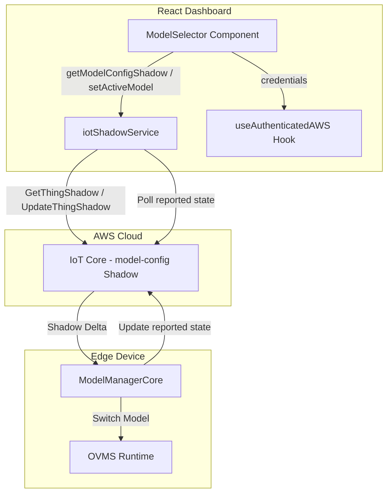
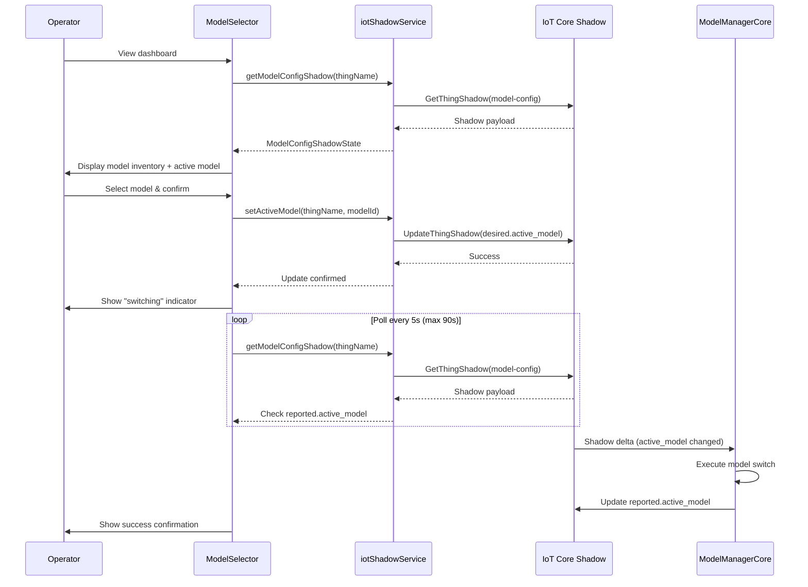
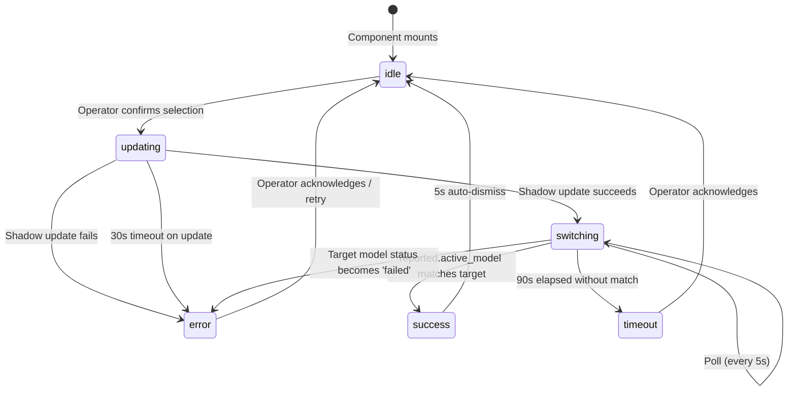

# Design Document: Dashboard Model Selection

## Overview

This feature adds a Model Selector component to the React dashboard that enables operators to view the model inventory on an edge device and switch the active inference model. The component communicates with the `model-config` named IoT Device Shadow to read model state and write desired active model changes. The device-side ModelManagerCore watches shadow deltas and orchestrates the actual model switch on the edge device.

The design follows the established pattern from `ConfidenceThresholdControl`: a self-contained component that accepts a `thingName` prop, uses the `useAuthenticatedAWS` hook for credentials, and calls the `iotShadowService` for shadow read/write operations.

## Architecture



### Data Flow



## Components and Interfaces

### 1. iotShadowService Extension

Extend the existing `IotShadowService` class with methods for the `model-config` shadow. The service remains a singleton instance.

```typescript
// New constants
const MODEL_CONFIG_SHADOW_NAME = 'model-config';

// New interfaces
export interface ModelMetadata {
  model_name: string;
  version: string;
  input_shape: number[];
  local_path: string;
}

export interface ModelEntry {
  status: 'ready' | 'installing' | 'failed';
  model_metadata: ModelMetadata;
  failure_reason?: string;
}

export interface ModelConfigShadowState {
  reported_active_model: string | null;
  reported_models: Record<string, ModelEntry>;
}

// New methods on IotShadowService
class IotShadowService {
  // ... existing methods ...

  async getModelConfigShadow(
    thingName: string,
    credentials: any,
    region: string
  ): Promise<ModelConfigShadowState | null>;

  async setActiveModel(
    thingName: string,
    credentials: any,
    region: string,
    modelId: string
  ): Promise<void>;
}
```

**Design Decision**: Extend the existing service rather than creating a new one. The service already handles IoT Data Plane client creation and error patterns. Adding methods for a different shadow name keeps the shadow interaction logic centralized.

### 2. ModelSelector Component

A new React component placed alongside `ConfidenceThresholdControl` in the dashboard configuration controls section.

```typescript
export interface ModelSelectorProps {
  thingName: string;
  className?: string;
}

export const ModelSelector: React.FC<ModelSelectorProps>;
```

**Internal State**:

| State | Type | Purpose |
|-------|------|---------|
| `models` | `Record<string, ModelEntry>` | Model inventory from reported state |
| `activeModelId` | `string \| null` | Currently active model from reported state |
| `selectedModelId` | `string \| null` | Model the operator has selected (before apply) |
| `switchState` | `'idle' \| 'updating' \| 'switching' \| 'success' \| 'error' \| 'timeout'` | Current operation state |
| `errorMessage` | `string` | Error description for display |
| `pollFailCount` | `number` | Consecutive poll failures during switching |

**State Machine**:



### 3. Dashboard Integration

The `ModelSelector` component is rendered in the `dashboard__configuration-controls` div, below the existing `ConfidenceThresholdControl`:

```tsx
<div className="dashboard__configuration-controls">
  <ConfidenceThresholdControl thingName={thingName} />
  <ModelSelector thingName={thingName} />
</div>
```

## Data Models

### Model Config Shadow Schema (as read from IoT)

```json
{
  "state": {
    "desired": {
      "active_model": "faster-rcnn"
    },
    "reported": {
      "active_model": "faster-rcnn",
      "models": {
        "faster-rcnn": {
          "status": "ready",
          "model_metadata": {
            "model_name": "faster_rcnn",
            "version": "1.0.0",
            "input_shape": [1, 255, 255, 3],
            "local_path": "/snap/ovms-engine/components/model-faster-rcnn/"
          }
        },
        "efficientnet": {
          "status": "installing",
          "model_metadata": {
            "model_name": "efficientnet",
            "version": "2.0.0",
            "input_shape": [1, 224, 224, 3],
            "local_path": "/snap/ovms-engine/components/model-efficientnet/"
          }
        },
        "custom-ppe": {
          "status": "failed",
          "failure_reason": "OVMS failed to load model within 60 seconds",
          "model_metadata": {
            "model_name": "custom_ppe",
            "version": "1.0.0",
            "input_shape": [1, 300, 300, 3],
            "local_path": "/var/snap/aws-iot-greengrass/current/ovms-engine-models/custom-ppe/"
          }
        }
      }
    }
  }
}
```

### TypeScript Types

```typescript
// types/modelConfig.ts

export type ModelStatus = 'ready' | 'installing' | 'failed';

export interface ModelMetadata {
  model_name: string;
  version: string;
  input_shape: number[];
  local_path: string;
}

export interface ModelEntry {
  status: ModelStatus;
  model_metadata: ModelMetadata;
  failure_reason?: string;
}

export type ModelInventory = Record<string, ModelEntry>;

export interface ModelConfigShadowState {
  reported_active_model: string | null;
  reported_models: ModelInventory;
}

export type ModelSwitchState =
  | 'idle'
  | 'updating'
  | 'switching'
  | 'success'
  | 'error'
  | 'timeout';
```


## Correctness Properties

*A property is a characteristic or behavior that should hold true across all valid executions of a system -- essentially, a formal statement about what the system should do. Properties serve as the bridge between human-readable specifications and machine-verifiable correctness guarantees.*

### Property 1: Shadow Parsing Preserves Model State

*For any* valid `model-config` shadow JSON payload containing a `state.reported` object with an `active_model` string and a `models` map of model entries (each with status, model_metadata containing model_name, version, input_shape, and local_path), parsing the payload into a `ModelConfigShadowState` SHALL preserve the active model ID and every model entry's model_id, status, model_name, version, input_shape, local_path, and failure_reason fields without loss or mutation.

**Validates: Requirements 1.1, 1.4, 3.1**

### Property 2: Model Selectability Derived from Status

*For any* model inventory (a map of model IDs to model entries with varying statuses), the selectability derivation function SHALL return `true` only for models with status `ready`, and `false` for models with status `installing` or `failed`.

**Validates: Requirements 2.2, 4.3**

### Property 3: Model Inventory Rendering Completeness

*For any* non-empty model inventory, the rendered ModelSelector output SHALL contain the model ID, model name, version, and status text for every model entry in the inventory.

**Validates: Requirements 2.1**

### Property 4: Shadow Update Payload Construction

*For any* non-empty model ID string, the `setActiveModel` method SHALL construct a shadow update payload with the structure `{ state: { desired: { active_model: <modelId> } } }` where the `active_model` value exactly equals the input model ID string.

**Validates: Requirements 4.1**

## Error Handling

### Service Layer Errors

| Error Source | Handling Strategy |
|---|---|
| `ResourceNotFoundException` from GetThingShadow | Return `null` from `getModelConfigShadow`. Component displays "no model configuration available" message. |
| Network timeout on GetThingShadow | Throw error with descriptive message. Component displays error with retry option. |
| `UnauthorizedException` / expired credentials | Throw error. Component disables controls and shows authentication required message. |
| Network timeout on UpdateThingShadow | Reject promise after 30s. Component shows timeout error, reverts selection, re-enables controls. |
| Malformed shadow payload (missing expected fields) | Parse defensively with fallback defaults. Return empty models map and null active_model for missing fields. |

### Component Error States

| State | Trigger | Recovery |
|---|---|---|
| Load error | Shadow read fails on mount or refresh | Display error message with retry button. Preserve any previously loaded state. |
| Update error | Shadow write fails when applying selection | Display error with failure reason. Revert selection to current active model. Re-enable controls. |
| Update timeout | Shadow write does not complete within 30s | Display timeout message. Re-enable controls. |
| Switch failure | Target model status becomes `failed` during polling | Display device-side failure message. Re-enable controls. |
| Switch timeout | 90s elapsed without reported.active_model matching target | Display timeout warning. Stop polling. Re-enable controls. |
| Poll connectivity | 3 consecutive poll failures | Display connectivity warning. Continue retrying on next interval. |

### Defensive Parsing

The shadow parsing logic handles malformed or partial data:

```typescript
function parseModelConfigShadow(payload: any): ModelConfigShadowState {
  const reported = payload?.state?.reported ?? {};
  const rawActiveModel = reported.active_model;
  const rawModels = reported.models ?? {};

  // Normalize active_model: treat null, undefined, empty string as null
  const reported_active_model =
    typeof rawActiveModel === 'string' && rawActiveModel.trim().length > 0
      ? rawActiveModel
      : null;

  // Parse each model entry defensively
  const reported_models: Record<string, ModelEntry> = {};
  for (const [modelId, entry] of Object.entries(rawModels)) {
    if (typeof entry === 'object' && entry !== null) {
      const e = entry as any;
      reported_models[modelId] = {
        status: ['ready', 'installing', 'failed'].includes(e.status)
          ? e.status
          : 'failed',
        model_metadata: {
          model_name: e.model_metadata?.model_name ?? modelId,
          version: e.model_metadata?.version ?? 'unknown',
          input_shape: Array.isArray(e.model_metadata?.input_shape)
            ? e.model_metadata.input_shape
            : [],
          local_path: e.model_metadata?.local_path ?? '',
        },
        failure_reason: e.failure_reason,
      };
    }
  }

  return { reported_active_model, reported_models };
}
```

## Testing Strategy

### Unit Tests (Example-Based)

Unit tests cover specific scenarios, error paths, and UI states:

- Component renders "no model configuration" when shadow does not exist
- Component renders "no models installed" when models map is empty
- Component disables all controls when thingName is empty
- Component disables all controls when credentials are null
- Active model is highlighted in the inventory list
- Active model ID not in inventory shows "not found" indicator
- Failed model with failure_reason displays the reason
- Failed model without failure_reason displays generic message
- Apply button disabled when selected model equals active model
- Loading indicator shown during shadow update
- Error message and selection revert on update failure
- Timeout error after 30s on shadow update
- Success confirmation shown for 5s after switch completes
- Switch failure detected when target model status becomes 'failed'
- Switch timeout after 90s of polling
- Connectivity warning after 3 consecutive poll failures
- Previously loaded state preserved on refresh error

### Property-Based Tests

Property tests use `vitest` with a property-based testing library (fast-check) to verify universal properties across generated inputs. Each test runs a minimum of 100 iterations.

| Property | Test Description | Generator Strategy |
|---|---|---|
| Property 1 | Shadow parsing preserves model state | Generate random shadow payloads with 0-10 models, varying statuses, random metadata fields, and random active_model values (including null/empty) |
| Property 2 | Model selectability from status | Generate random model inventories with mixed statuses, verify selectability function output |
| Property 3 | Rendering completeness | Generate random model inventories (1-10 models), render component, verify all fields present in output |
| Property 4 | Payload construction | Generate random non-empty strings as model IDs, verify constructed payload structure |

**Configuration**:
- Library: `fast-check` (well-maintained, TypeScript-native)
- Iterations: 100 minimum per property
- Tag format: `Feature: dashboard-model-selection, Property {N}: {description}`

### Integration Tests

Integration tests verify the component works with the real service layer (mocked AWS SDK):

- Full flow: load inventory, select model, apply, poll, success
- Full flow: load inventory, select model, apply, poll, device failure
- Credentials refresh during active polling session
