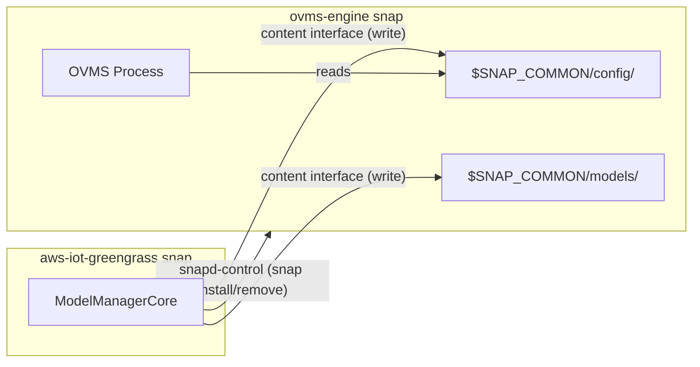
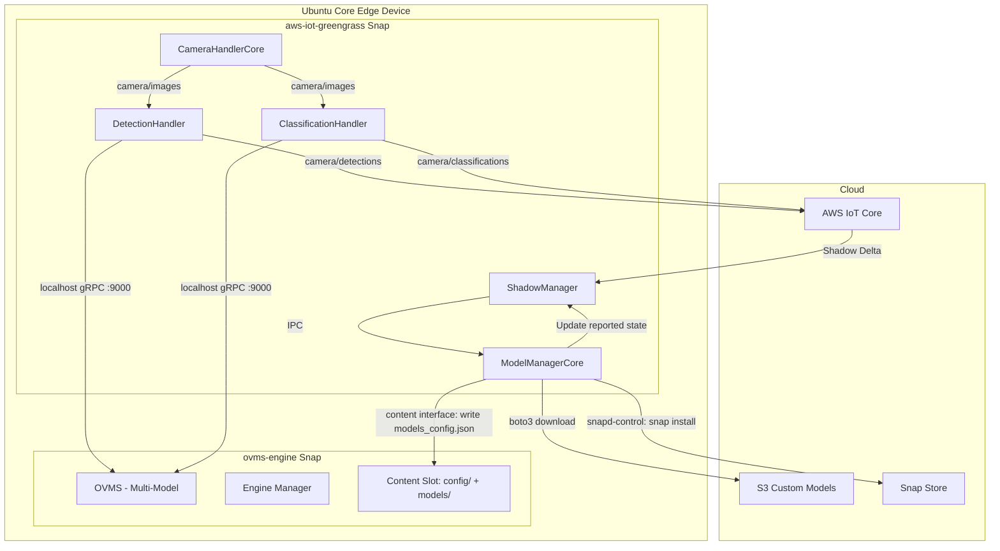
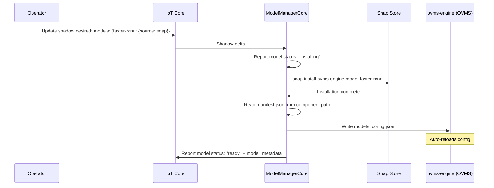
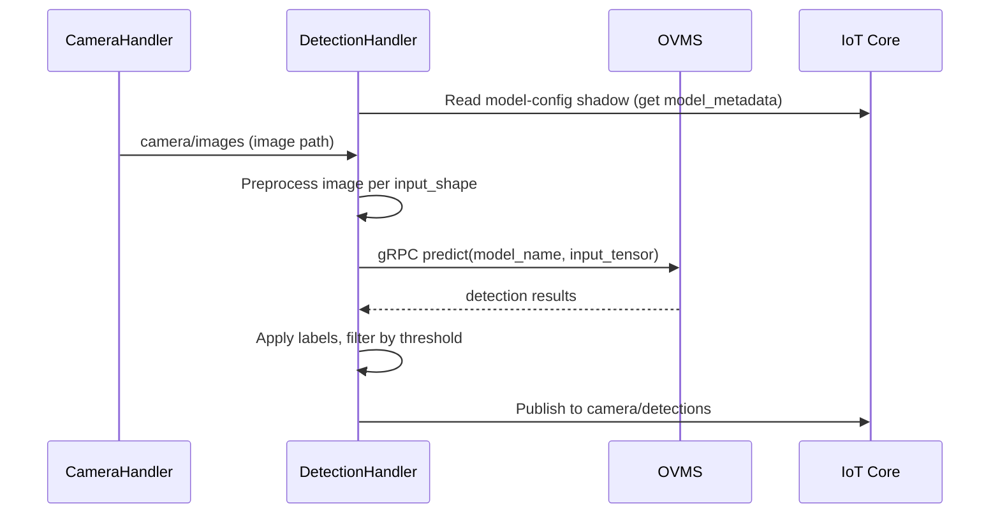

# Design Document: Dynamic Model Management (Simplified)

## Overview

A shadow-driven system for installing and serving multiple OpenVINO models simultaneously on an Ubuntu Core edge device. The operator declares desired models in the IoT Device Shadow; the ModelManagerCore component orchestrates installation (via snap or S3) and configures OVMS to serve them all. Separate inference handler components (one per model type) read their configuration from the shadow and call OVMS independently.

## Ubuntu Core Snap Confinement Model

The system operates across two strictly-confined snaps on Ubuntu Core. Cross-snap communication uses Canonical's recommended mechanisms:

### Snap Boundaries

| Snap | Role | Key Interfaces |
|------|------|----------------|
| **aws-iot-greengrass** | Orchestration — runs Greengrass components (ModelManagerCore, handlers) | `snapd-control` (manage snap installs), content plug (write to ovms-engine config) |
| **ovms-engine** | Inference runtime — runs OVMS, delivers model components | content slot (expose writable config dir), `network-bind` (gRPC port 9000) |

### Cross-Snap Communication



**Content Interface** (Canonical-recommended for cross-snap filesystem sharing):
- The ovms-engine snap exposes a writable content slot for `$SNAP_COMMON/config/` and `$SNAP_COMMON/models/`
- The Greengrass snap connects a content plug, gaining write access to these directories
- This is model-type agnostic — any configuration format (JSON, protobuf text) can be written
- Auto-connects between snaps from the same publisher

**snapd-control Interface**:
- The Greengrass snap uses `snapd-control` to install/remove snap components (e.g., `snap install ovms-engine.model-faster-rcnn`)
- This is a super-privileged interface, appropriate for brand store deployments on Ubuntu Core

**Network (localhost)**:
- Inference handlers call OVMS via gRPC on `localhost:9000`
- Both snaps have `network` plug for localhost communication

### ovms-engine Snap Interface Definitions

```yaml
# In ovms-engine snapcraft.yaml
slots:
  inference-config:
    interface: content
    content: inference-config
    write:
      - $SNAP_COMMON/config
  inference-models:
    interface: content
    content: inference-models
    write:
      - $SNAP_COMMON/models
```

### Greengrass Snap Interface Definitions

```yaml
# In aws-iot-greengrass snapcraft.yaml
plugs:
  inference-config:
    interface: content
    content: inference-config
    target: $SNAP_DATA/ovms-engine-config
  inference-models:
    interface: content
    content: inference-models
    target: $SNAP_DATA/ovms-engine-models
  snapd-control:
    interface: snapd-control
```

### Path Resolution

ModelManagerCore resolves paths through the content interface mount points:

| Logical Path | Actual Path (from Greengrass snap) | Maps To (in ovms-engine snap) |
|---|---|---|
| OVMS config | `$SNAP_DATA/ovms-engine-config/models_config.json` | `$SNAP_COMMON/config/models_config.json` |
| S3 model storage | `$SNAP_DATA/ovms-engine-models/{model_id}/` | `$SNAP_COMMON/models/{model_id}/` |

### Snap Component Paths

Snap-delivered models are installed as components of the ovms-engine snap. Their paths are accessible to OVMS (running inside ovms-engine) at:
- `$SNAP/components/model-faster-rcnn/` (read-only, managed by snapd)

ModelManagerCore does not need write access to component paths — it only reads `manifest.json` from them after installation. The content interface provides read access to the component directory for manifest reading.

## Architecture



## Shadow Schema

### Desired State (operator writes this)

```json
{
  "state": {
    "desired": {
      "models": {
        "faster-rcnn": { "source": "snap" },
        "efficientnet": { "source": "snap" },
        "custom-ppe-detector": { "source": "s3", "s3_uri": "s3://my-bucket/models/ppe/1.0/" }
      }
    }
  }
}
```

### Reported State (device writes this)

```json
{
  "state": {
    "reported": {
      "engine": "gpu",
      "status": "ready",
      "models": {
        "faster-rcnn": {
          "status": "ready",
          "model_metadata": {
            "model_name": "faster_rcnn",
            "input_name": "input_tensor",
            "output_names": ["detection_boxes", "detection_classes", "detection_scores", "num_detections"],
            "input_shape": [1, 255, 255, 3],
            "labels_file": "labels.txt",
            "local_path": "/snap/ovms-engine/components/model-faster-rcnn/"
          }
        },
        "efficientnet": {
          "status": "ready",
          "model_metadata": {
            "model_name": "efficientnet",
            "input_name": "input",
            "output_names": ["predictions"],
            "input_shape": [1, 224, 224, 3],
            "labels_file": "labels.txt",
            "local_path": "/snap/ovms-engine/components/model-efficientnet/"
          }
        }
      }
    }
  }
}
```

## Components

### 1. ModelManagerCore

Single Greengrass component responsible for:
1. Subscribing to `model-config` shadow delta
2. Installing snap models via `snap install ovms-engine.model-{id}`
3. Downloading S3 models via `boto3.download_file()` to `$SNAP_COMMON/models/{model_id}/`
4. Reading `manifest.json` from each installed model
5. Writing `$SNAP_COMMON/config/models_config.json` with all ready models
6. Updating shadow reported state with model status and metadata

**No separate S3ModelDownloader component.** S3 downloads are handled directly in ModelManagerCore using boto3 — simpler for a demo.

### 2. DetectionHandler

Replaces the current hardcoded InferenceHandlerCore for object detection models. Reads its model config from the shadow reported state.

- Subscribes to `camera/images`
- Reads model_metadata for its assigned model from shadow
- Calls OVMS gRPC with the correct model name, input tensor, output tensors
- Publishes detection results to `camera/detections`

### 3. ClassificationHandler

New component for image classification models. Same pattern as DetectionHandler but interprets output as class probabilities.

- Subscribes to `camera/images`
- Reads model_metadata for its assigned model from shadow
- Calls OVMS gRPC, gets class probability vector
- Publishes top-N classifications to `camera/classifications`

### 4. ovms-engine Snap (existing, updated for content interface)

Already provides:
- OVMS runtime with hardware engine auto-detection
- Model components installable via snap
- `$SNAP_COMMON/config/models_config.json` monitoring for hot-reload
- gRPC endpoint on port 9000

**Content interface slots** (enables cross-snap config writes from Greengrass):
```yaml
slots:
  inference-config:
    interface: content
    content: inference-config
    write:
      - $SNAP_COMMON/config
  inference-models:
    interface: content
    content: inference-models
    write:
      - $SNAP_COMMON/models
```

The Greengrass snap connects to these slots, gaining write access to the config and models directories. This is the Canonical-recommended mechanism for cross-snap data sharing on Ubuntu Core and is model-type agnostic (supports CV models, VLMs, LLMs, or any future model type).

## OVMS Multi-Model Configuration

Written by ModelManagerCore to `$SNAP_COMMON/config/models_config.json`:

```json
{
  "model_config_list": [
    {
      "config": {
        "name": "faster_rcnn",
        "base_path": "/snap/ovms-engine/components/model-faster-rcnn"
      }
    },
    {
      "config": {
        "name": "efficientnet",
        "base_path": "/snap/ovms-engine/components/model-efficientnet"
      }
    }
  ]
}
```

## Model Manifest Schema

Each model (snap or S3) includes `manifest.json`:

```json
{
  "model_id": "faster-rcnn",
  "model_name": "faster_rcnn",
  "version": "1.0.0",
  "input_name": "input_tensor",
  "output_names": ["detection_boxes", "detection_classes", "detection_scores", "num_detections"],
  "input_shape": [1, 255, 255, 3],
  "labels_file": "labels.txt"
}
```

## Flow: Model Installation



## Flow: Inference (Detection)



## What's Deliberately Out of Scope

- Dashboard UI (shadow manipulation via console/CLI is sufficient)
- Download pause/resume/cancel
- Download queuing or concurrent transfer management
- OVMS health monitoring with restart retries
- Crash recovery for interrupted downloads
- Storage threshold enforcement
- Engine compatibility gating
- Formal property-based testing (simple integration tests suffice)
- Separate S3ModelDownloader component
