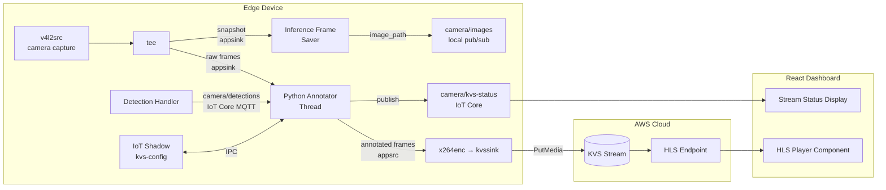

# Design Document: KVS Video Streaming

## Overview

This design adds AWS Kinesis Video Streams (KVS) video transport to the existing Greengrass-based computer vision solution. The feature introduces two primary components:

1. **KVS Producer Greengrass Component** (`com.example.KvsProducer`) — runs on the edge device, owns the camera directly via a GStreamer pipeline, annotates frames with bounding boxes and labels from inference results, encodes them into H.264 video, and streams to a KVS stream in the cloud. It also publishes inference snapshot frames to the `camera/images` topic, taking over the Camera Handler's camera capture role when running.

2. **HLS Video Player** — a React component embedded in the existing dashboard that obtains an HLS streaming session URL from KVS using Cognito credentials and plays the live annotated feed.

Supporting changes include AWS resource provisioning (KVS stream, IAM policies), device shadow configuration for runtime tuning, and stream health monitoring via MQTT.

### Design Decisions

| Decision | Rationale |
|----------|-----------|
| Custom KVS Producer component (not `aws.iot.EdgeConnectorForKVS` or `aws.kinesisvideo.KvsEdgeComponent`) | The AWS-provided KVS Greengrass components only support RTSP IP cameras as video sources. Our use case requires programmatic frame injection with pre-encoding annotation. Additionally, `EdgeConnectorForKVS` requires AWS IoT SiteWise/TwinMaker and is limited to specific regions. |
| GStreamer `v4l2src` + `tee` for camera capture | GStreamer's `tee` element splits one camera capture feed into two branches — one for KVS H.264 encoding and one for inference snapshots — avoiding the V4L2 single-streamer limitation that prevents two processes opening the same USB device simultaneously. |
| KVS Producer takes over camera capture from Camera Handler | With GStreamer owning the camera, the Camera Handler would conflict for the device. The KVS Producer publishes inference snapshots to `camera/images` at the same cadence, preserving the Detection Handler interface unchanged. Camera Handler becomes a SOFT dependency. |
| Frame annotation in Python (OpenCV) before passing to GStreamer | Keeps annotation logic testable in pure Python; OpenCV is already a project dependency in the detection handler. Raw frames are delivered to Python via `appsink`; annotated frames are pushed back into the encoding pipeline via `appsrc`. |
| Time-window annotation | The KVS Producer captures at 15 fps while inference runs every ~10 seconds. Rather than leaving most frames unannotated, the annotator applies the most recent detection result to all video frames within a configurable staleness window (default 30 seconds). This matches how commercial annotated video systems work and gives a better operator experience. |
| kvssink internal buffering for network resilience | The KVS Producer SDK's `kvssink` element has built-in network resilience buffering. This replaces a Python-level raw-frame ring buffer, which would require gigabytes of memory for 120 seconds of uncompressed video at 1280×720. |
| `camera/detections` subscribed via IoT Core MQTT | The Detection Handler publishes to `camera/detections` via `PublishToIoTCore`. The KVS Producer must subscribe via `SubscribeToIoTCore`, not local pub/sub. |
| HLS playback (not WebRTC) in the dashboard | HLS is simpler to integrate, works behind corporate firewalls, and the latency (10–30 seconds) is acceptable for monitoring. |
| Named device shadow (`kvs-config`) for runtime configuration | Follows the existing `model-config` shadow pattern; allows remote tuning without redeployment. |
| Health metrics published to IoT Core topic | Consistent with existing detection result publishing; enables CloudWatch rules and dashboard display. |
| TES credentials via AWS credential provider chain | Greengrass automatically sets `AWS_CONTAINER_CREDENTIALS_RELATIVE_URI` for components that declare `aws.greengrass.TokenExchangeService` as a dependency. The AWS SDK credential chain picks this up, so `kvssink` inherits automatic credential refresh with no explicit refresh thread required. |

## Architecture



### Data Flow

1. **KVS Producer** starts the `CapturePipeline`, opening `/dev/video0` via `v4l2src` at the configured frame rate and resolution.
2. The `tee`'s **raw frame branch** delivers frames at full frame rate to the Python annotator thread via `appsink`.
3. The `tee`'s **snapshot branch** fires every `snapshot_interval_seconds` (default 10s): Python saves the JPEG to disk and publishes `{"image_path": ..., "timestamp": ...}` to `camera/images` via local pub/sub, preserving the existing Detection Handler interface unchanged.
4. **Detection Handler** receives `camera/images`, runs inference, and publishes results to `camera/detections` via **IoT Core MQTT**.
5. **KVS Producer** receives `camera/detections` via `SubscribeToIoTCore`. `FrameAnnotator.update_detections()` stores the result with a `received_at` timestamp.
6. For each raw frame from step 2, `FrameAnnotator.annotate()` draws the stored detection boxes if they are within the staleness window; otherwise returns the raw frame unchanged.
7. The annotated frame is pushed into the `EncodingPipeline`'s `appsrc`. GStreamer encodes to H.264 and `kvssink` streams to KVS via `PutMedia`. **`kvssink`'s internal buffer handles up to 120 seconds of network outage natively.**
8. **Dashboard** calls `GetHLSStreamingSessionURL` with `PlaybackMode: LIVE` and `ContainerFormat: FRAGMENTED_MP4`, then plays the stream via `hls.js`.

## Components and Interfaces

### 1. KVS Producer Component (`com.example.KvsProducer`)

**Language:** Python 3  
**Key Dependencies:** `awsiot-greengrasscoreipc`, `opencv-python-headless`, `gi` (PyGObject for GStreamer bindings)

| Module | Responsibility |
|--------|---------------|
| `kvs_producer.py` | Main entry point; orchestrates frame pipeline, shadow config, health reporting |
| `frame_annotator.py` | Draws bounding boxes and labels onto frames using OpenCV; applies time-window logic |
| `gstreamer_pipeline.py` | Manages `CapturePipeline` and `EncodingPipeline` lifecycle |
| `shadow_config.py` | Reads/writes the `kvs-config` named device shadow |
| `health_monitor.py` | Tracks metrics and publishes to `camera/kvs-status` |

**Greengrass Recipe Dependencies:**

| Dependency | Type |
|------------|------|
| `com.example.CameraHandlerCore` | SOFT — KVS Producer takes over camera capture when running |
| `com.example.DetectionHandler` | SOFT |
| `aws.greengrass.ShadowManager` | HARD |
| `aws.greengrass.TokenExchangeService` | HARD |

**IPC Access Control:**

| Access | Type |
|--------|------|
| Publish to `camera/images` | local pub/sub |
| Subscribe to `camera/detections` | **IoT Core MQTT** (`SubscribeToIoTCore`) |
| Get/Update shadow `kvs-config` | shadow IPC |
| Publish to IoT Core `camera/kvs-status` | IoT Core |

### 2. Frame Annotator Module

```python
@dataclass
class DetectionBox:
    ymin: float
    xmin: float
    ymax: float
    xmax: float

@dataclass
class Detection:
    label: str
    score: float    # 0.0 – 1.0
    box: DetectionBox

class FrameAnnotator:
    """Draws detection results onto camera frames using a time-window model."""

    def __init__(self, staleness_window_seconds: float = 30.0, num_classes: int = 10):
        """Initialize with staleness window and a colour palette for up to num_classes."""

    def update_detections(self, detections: list[Detection], received_at: float) -> None:
        """Called when a new camera/detections message arrives. Stores detections
        and received_at timestamp for use by annotate()."""

    def annotate(self, frame: np.ndarray, frame_time: float) -> np.ndarray:
        """Annotate frame with current detections if received_at is within
        staleness_window_seconds of frame_time. Returns a copy pixel-identical
        to the input if no valid detections are available. The input frame is
        never modified in place."""

    def get_colour(self, class_label: str) -> tuple[int, int, int]:
        """Return consistent BGR colour for a given class label."""
```

### 3. GStreamer Pipeline Modules

```python
class CapturePipeline:
    """v4l2src → tee → appsink (raw frames) + appsink (inference snapshots).

    Pipeline string:
      v4l2src device={device} ! video/x-raw,width={w},height={h},framerate={fps}/1
      ! tee name=t
      t. ! queue ! videoconvert ! video/x-raw,format=BGR ! appsink name=raw_sink emit-signals=true
      t. ! queue ! videorate ! image/jpeg,framerate=1/{snapshot_interval} ! jpegenc
         ! appsink name=snapshot_sink emit-signals=true
    """

    def __init__(self, device: str, framerate: int, width: int, height: int,
                 snapshot_interval_seconds: int):

    def set_on_raw_frame(self, callback: Callable[[np.ndarray, float], None]) -> None:
        """Register callback invoked for every raw frame: (frame_bgr, capture_timestamp)."""

    def set_on_snapshot(self, callback: Callable[[bytes], None]) -> None:
        """Register callback invoked at snapshot cadence: (jpeg_bytes,)."""

    def start(self) -> None
    def stop(self) -> None
    def is_healthy(self) -> bool


class EncodingPipeline:
    """appsrc → videoconvert → x264enc → h264parse → kvssink.

    kvssink reads AWS credentials automatically via the AWS SDK credential
    provider chain. Greengrass sets AWS_CONTAINER_CREDENTIALS_RELATIVE_URI
    for components that declare aws.greengrass.TokenExchangeService, so
    credential refresh requires no additional code.
    """

    def __init__(self, stream_name: str, region: str, framerate: int,
                 width: int, height: int):

    def push_frame(self, frame: np.ndarray) -> bool:
        """Push a BGR frame. Returns False if pipeline is not in PLAYING state."""

    def start(self) -> None
    def stop(self) -> None
    def is_healthy(self) -> bool
    def reconfigure(self, framerate: int, width: int, height: int) -> None:
        """Restart pipeline with new parameters."""
```

### 4. Shadow Configuration Module

```python
@dataclass
class KvsConfig:
    stream_name: str
    frame_rate: int                   # 1–30 fps
    resolution: str                   # "640x480" | "1280x720" | "1920x1080"
    streaming_enabled: bool
    staleness_window_seconds: float   # seconds; detections older than this are not applied
    snapshot_interval_seconds: int    # cadence at which inference snapshots are saved (1–3600)

VALID_RESOLUTIONS = {"640x480", "1280x720", "1920x1080"}
DEFAULT_CONFIG = KvsConfig(
    stream_name="",                   # Falls back to recipe configuration
    frame_rate=15,
    resolution="640x480",             # Matches Camera Handler default capture resolution
    streaming_enabled=True,
    staleness_window_seconds=30.0,
    snapshot_interval_seconds=10,
)
```

> **Resolution note:** The `resolution` field must match the Camera Handler's configured capture resolution to avoid unnecessary scaling. The default `640x480` matches the Camera Handler's default. If the Camera Handler is reconfigured to a higher resolution, update `resolution` in the shadow accordingly.

```python
class ShadowConfigManager:
    """Manages KVS configuration via the kvs-config device shadow."""

    def read_config(self) -> KvsConfig:
        """Read and validate config from shadow. Returns DEFAULT_CONFIG on failure."""

    def apply_delta(self, delta: dict) -> tuple[KvsConfig, list[str]]:
        """Validate and apply shadow delta. Returns (new_config, rejection_reasons)."""

    def report_state(self, config: KvsConfig, status: str) -> None:
        """Update shadow reported state with active config and streaming status."""
```

### 5. Health Monitor Module

```python
@dataclass
class StreamMetrics:
    frames_sent: int
    frames_dropped: int
    bitrate_kbps: float
    connection_status: str  # "streaming" | "buffering" | "offline" | "error"

class HealthMonitor:
    """Tracks stream health and publishes metrics every 30 seconds."""

    def record_frame_sent(self) -> None
    def record_frame_dropped(self) -> None
    def update_bitrate(self, bytes_sent: int, elapsed_seconds: float) -> None
    def set_status(self, status: str) -> None
    def get_current_metrics(self) -> StreamMetrics
    def publish_metrics(self) -> None  # Publishes to camera/kvs-status
```

### 6. HLS Player React Component

```typescript
interface KvsPlayerProps {
  streamName: string;
  region: string;
}

const KvsPlayer: React.FC<KvsPlayerProps> = ({ streamName, region }) => {
  // Uses useAuth() hook for Cognito credentials
  // Calls KVS GetHLSStreamingSessionURL with parameters:
  //   PlaybackMode: "LIVE"
  //   HLSFragmentSelector: { FragmentSelectorType: "SERVER_TIMESTAMP" }
  //   ContainerFormat: "FRAGMENTED_MP4"
  //   DiscontinuityMode: "ALWAYS"
  //   DisplayFragmentTimestamp: "ALWAYS"
  //   Expires: 3600
  // Renders <video> element with hls.js
  // Displays connection status overlay
  // Handles credential refresh on expiry
};
```

**Expected latency:** 10–30 seconds end-to-end with `FRAGMENTED_MP4` + `LIVE` mode, depending on kvssink fragment duration and hls.js buffer configuration. This latency is acceptable for remote monitoring.

### 7. Setup Script Extension

The existing `setup_aws_resources.py` is extended with:
- `create_kvs_stream(stream_name, retention_hours=24)` — creates the KVS stream
- `attach_kvs_producer_policy(role_name, stream_arn)` — grants PutMedia, CreateStream, DescribeStream, GetDataEndpoint
- `attach_kvs_viewer_policy(role_name, stream_arn)` — grants GetHLSStreamingSessionURL, GetDataEndpoint, DescribeStream

### 8. Snap Deployment on Ubuntu Core

Ubuntu Core is an immutable snap-based OS. The KVS Producer SDK's GStreamer plugin (`libgstkvssink.so`) must be compiled from source during the Greengrass component's `Install` lifecycle step.

**Install lifecycle steps:**
1. Install build dependencies via `apt-get` (available on Ubuntu Core 22+ via the base snap): `cmake`, `g++`, `libssl-dev`, `libcurl4-openssl-dev`, `libgstreamer1.0-dev`, `gstreamer1.0-plugins-base`, `gstreamer1.0-plugins-good`, `gstreamer1.0-plugins-bad`, `python3-gi`, `gir1.2-gstreamer-1.0`
2. Clone and compile `amazon-kinesis-video-streams-producer-sdk-cpp` with `-DBUILD_GSTREAMER_PLUGIN=ON`
3. Set `GST_PLUGIN_PATH` in the `Run` lifecycle to the build output directory so GStreamer discovers `libgstkvssink.so`

**Recipe lifecycle sketch:**

```yaml
ComponentConfiguration:
  DefaultConfiguration:
    KvsProducerSdkBuildDir: "{work:path}/kvs-producer-sdk-build"
    Region: "us-east-1"

Lifecycle:
  Install:
    Script: |
      apt-get install -y cmake g++ libssl-dev libcurl4-openssl-dev \
        libgstreamer1.0-dev gstreamer1.0-plugins-base \
        gstreamer1.0-plugins-good gstreamer1.0-plugins-bad \
        python3-gi gir1.2-gstreamer-1.0
      git clone --depth 1 \
        https://github.com/awslabs/amazon-kinesis-video-streams-producer-sdk-cpp \
        {configuration:/KvsProducerSdkBuildDir}/src
      cmake -S {configuration:/KvsProducerSdkBuildDir}/src \
            -B {configuration:/KvsProducerSdkBuildDir}/build \
            -DBUILD_GSTREAMER_PLUGIN=ON
      cmake --build {configuration:/KvsProducerSdkBuildDir}/build --parallel 4
  Run:
    Script: |
      export GST_PLUGIN_PATH={configuration:/KvsProducerSdkBuildDir}/build
      export AWS_DEFAULT_REGION={configuration:/Region}
      python3 {artifacts:path}/kvs_producer.py
```

> **Build time:** Compiling the KVS Producer SDK takes 5–15 minutes on typical edge hardware. This cost is paid once per deployment.

**Camera device access:** The Greengrass snap requires the `camera` snap interface to access `/dev/video0`. Connect it once after snap installation:
```
snap connect aws-iot-greengrass:camera
```

## Data Models

### KVS Configuration Shadow (`kvs-config`)

```json
{
  "state": {
    "desired": {
      "stream_name": "ubuntu-core-gg-demo-stream",
      "frame_rate": 15,
      "resolution": "640x480",
      "streaming_enabled": true,
      "staleness_window_seconds": 30.0,
      "snapshot_interval_seconds": 10
    },
    "reported": {
      "stream_name": "ubuntu-core-gg-demo-stream",
      "frame_rate": 15,
      "resolution": "640x480",
      "streaming_enabled": true,
      "staleness_window_seconds": 30.0,
      "snapshot_interval_seconds": 10,
      "streaming_status": "streaming"
    }
  }
}
```

**Validation Rules:**
- `frame_rate`: integer, 1 ≤ value ≤ 30
- `resolution`: one of `"640x480"`, `"1280x720"`, `"1920x1080"`
- `streaming_enabled`: boolean
- `staleness_window_seconds`: float > 0
- `snapshot_interval_seconds`: integer, 1 ≤ value ≤ 3600
- `streaming_status` (reported only): one of `"streaming"`, `"stopped"`, `"error"`

> **Status field note:** `streaming_status` in the shadow (`streaming`, `stopped`, `error`) reflects the operator-controlled streaming state and intentionally omits transient states. `connection_status` in health metrics (`streaming`, `buffering`, `offline`, `error`) reflects real-time transport state observed by the health monitor. These are distinct fields with different purposes and different value sets.

### Stream Health Message (`camera/kvs-status`)

```json
{
  "timestamp": "2024-01-15T10:30:00Z",
  "frames_sent": 450,
  "frames_dropped": 2,
  "bitrate_kbps": 2500.0,
  "connection_status": "streaming",
  "error_reason": null
}
```

### Detection Message (`camera/detections`) — existing format

```json
{
  "model": "faster-rcnn",
  "detections": [
    {
      "label": "person",
      "score": 0.95,
      "box": { "ymin": 100.0, "xmin": 50.0, "ymax": 400.0, "xmax": 200.0 }
    }
  ],
  "count": 1,
  "threshold": 0.5
}
```

Bounding box coordinates are pixel values in a nested `box` object. The `Detection` dataclass maps to this structure via `DetectionBox`. The KVS Producer subscribes to this topic via `SubscribeToIoTCore`.

## Correctness Properties

*A property is a characteristic or behavior that should hold true across all valid executions of a system.*

### Property 1: Time-window annotation

*For any* video frame where the most recent detection result's `received_at` timestamp is more than `staleness_window_seconds` before the frame's `frame_time`, `annotate()` SHALL return a copy pixel-identical to the input frame. *For any* frame where the most recent detection result's `received_at` is within `staleness_window_seconds` of `frame_time`, `annotate()` SHALL draw bounding boxes for all detections in that result.

**Validates: Requirements 2.3, 2.6**

### Property 2: Bounding boxes drawn at specified pixel coordinates

*For any* valid frame (non-empty numpy array with 3 colour channels) and any list of detections with pixel coordinates within the frame dimensions, calling `annotate()` SHALL modify pixels along the bounding box edges defined by `(box.xmin, box.ymin, box.xmax, box.ymax)` for each detection, such that the annotated frame differs from the original at those boundary pixels.

**Validates: Requirements 2.1**

### Property 3: Confidence score formatting

*For any* confidence score value between 0.0 and 1.0 (inclusive), the formatted label text SHALL contain the score expressed as a percentage rounded to exactly one decimal place (e.g., 0.956 → "95.6%").

**Validates: Requirements 2.2**

### Property 4: Empty detections preserve frame identity

*For any* valid frame (non-empty numpy array with 3 colour channels), calling `annotate()` when no detections are within the staleness window SHALL return **a copy** pixel-identical to the input frame. The input frame SHALL NOT be modified in place.

**Validates: Requirements 2.3**

### Property 5: Colour assignment consistency

*For any* class label string, calling `get_colour(label)` multiple times SHALL always return the same BGR colour tuple, AND the colour palette SHALL contain at least 10 distinct colours.

**Validates: Requirements 2.4**

### Property 6: Stale detection discard

*For any* `(frame_time, received_at, staleness_window_seconds)` triple where `frame_time - received_at > staleness_window_seconds`, `annotate()` SHALL NOT apply that detection result to the frame.

**Validates: Requirements 2.6**

### Property 7: Configuration validation

*For any* shadow payload, if `frame_rate` is an integer in [1, 30] AND `resolution` is one of {"640x480", "1280x720", "1920x1080"} AND `streaming_enabled` is a boolean AND `staleness_window_seconds` is a float > 0 AND `snapshot_interval_seconds` is an integer in [1, 3600], then `apply_delta` SHALL produce a valid `KvsConfig` matching those values. Conversely, *for any* shadow payload where any of these conditions is violated, `apply_delta` SHALL reject the invalid values, retain the previous valid configuration unchanged, and include a non-empty rejection reason.

**Validates: Requirements 6.1, 6.5**

## Error Handling

### KVS Producer Error Scenarios

| Error Condition | Handling Strategy | Recovery |
|----------------|-------------------|----------|
| Network loss (≤ 120s) | `kvssink` buffers encoded frames internally | Auto-resumes in transmission order when connectivity restored |
| Network loss (> 120s) | `kvssink` buffer full, oldest encoded frames dropped | Continues buffering newest frames; resumes when connected |
| Network unreachable > 300s | `kvssink` signals pipeline error via GStreamer bus message | Python catches bus error, publishes error to `camera/kvs-status`, attempts 3 restarts at 30s intervals |
| KVS stream deleted | Unrecoverable error | Publish error, attempt restart (which will recreate stream) |
| Invalid credentials | Unrecoverable error | Publish error, attempt restart (Token Exchange Service refreshes credentials via provider chain) |
| GStreamer pipeline error | Pipeline crash | Log error, restart both `CapturePipeline` and `EncodingPipeline` with current configuration |
| Shadow unavailable on startup | Degraded start | Use default config, retry shadow read every 30s |
| Invalid shadow config values | Reject invalid values | Retain previous valid config, report rejection in shadow reported state |
| Camera device unavailable on startup | Startup delay | Wait 30s, then retry every 10s with error logging |
| Detection Handler not running | Normal operation | Frames stream unannotated; annotator applies detections when they resume arriving |
| All 3 restart attempts exhausted | Terminal error state | Publish final error message, remain in error state until manual restart or redeployment |

### Dashboard Error Scenarios

| Error Condition | Handling Strategy | Recovery |
|----------------|-------------------|----------|
| GetHLSStreamingSessionURL fails | Display error message | Retry up to 3 times at 5-second intervals, then show persistent error |
| Stream offline (no data) | Display "Stream Offline" status | Stop playback attempts; resume on manual refresh or stream resumption |
| Cognito credentials expired | Transparent refresh | Refresh credentials via AuthContext, re-establish HLS session without page reload |
| Network error during playback | HLS.js handles buffering | hls.js internal retry; display "buffering" status |

### Setup Script Error Scenarios

| Error Condition | Handling Strategy |
|----------------|-------------------|
| KVS stream creation fails | Log error with AWS API error message, exit with non-zero code |
| IAM policy attachment fails | Log error with AWS API error message, exit with non-zero code |
| KVS stream already exists | Skip creation, log confirmation message |
| IAM policy already attached | Skip attachment, continue without error |

## Testing Strategy

### Unit Tests (Example-Based)

**KVS Producer (Python — pytest):**
- Recipe validation: verify component dependencies are declared correctly, including CameraHandlerCore as SOFT
- Shadow config: test default values when shadow is unavailable
- Shadow config: test streaming enable/disable state transitions
- Shadow config: test rejection of invalid `staleness_window_seconds` (≤ 0) and `snapshot_interval_seconds` (out of range)
- Health monitor: verify metrics message structure matches schema
- Health monitor: verify error status published after 60s transmission failure
- Restart logic: verify 3 attempts at 30-second intervals, then terminal error state

**CapturePipeline (Python — pytest with GStreamer test pipeline):**
- Verify `on_raw_frame` callback fires at configured frame rate
- Verify `on_snapshot` callback fires at `snapshot_interval_seconds` cadence
- Verify snapshot JPEG is saved to disk and `camera/images` published with correct `image_path`

**Frame Annotator (Python — pytest):**
- Frames within staleness window are annotated with stored detection boxes
- Frames outside staleness window are returned as pixel-identical copies, input unmodified
- Performance benchmark: annotation completes within 50ms for typical frame sizes
- Annotation with multiple overlapping detections
- `update_detections` with empty list clears annotations

**Dashboard (TypeScript — vitest):**
- KvsPlayer renders video element
- KvsPlayer displays "offline" status when stream has no data
- KvsPlayer retries GetHLSStreamingSessionURL 3 times on failure
- KvsPlayer passes correct parameters to GetHLSStreamingSessionURL (PlaybackMode, ContainerFormat, etc.)
- KvsPlayer refreshes credentials on expiry without page reload
- Dashboard layout shows both HLS player and S3 gallery simultaneously
- Stream status indicator updates from MQTT messages

**Setup Script (Python — pytest):**
- KVS stream creation with correct retention period
- Idempotent behavior when stream already exists
- IAM policy document contains correct actions and resource ARN
- Error handling: non-zero exit on AWS API failure

### Property-Based Tests (Python — Hypothesis)

Each test runs a minimum of 100 iterations (`@settings(max_examples=100)`).

| Property | Test Description | Generator Strategy |
|----------|-----------------|-------------------|
| Property 1 | Time-window annotation | Random `(frame_time, received_at, staleness_window_seconds)` triples; verify annotation applied iff `frame_time - received_at ≤ staleness_window_seconds` |
| Property 2 | Bounding boxes at correct coordinates | Random frame dimensions (100–1920 × 100–1080), random `DetectionBox` coordinates within bounds |
| Property 3 | Confidence score formatting | Random floats in [0.0, 1.0] |
| Property 4 | Empty detections preserve frame | Random numpy arrays (various dimensions, 3 channels); verify copy returned, input unchanged |
| Property 5 | Colour assignment consistency | Random Unicode strings as class labels |
| Property 6 | Stale detection discard | Random `(frame_time, received_at, staleness_window)` triples where `frame_time - received_at > staleness_window`; verify no annotation |
| Property 7 | Configuration validation | Random integers (including out-of-range for `frame_rate`, `snapshot_interval_seconds`), random strings (valid/invalid resolutions), random booleans, random floats (including ≤ 0 for `staleness_window_seconds`) |

**Test tag convention:** Each test tagged with `# Feature: kvs-video-streaming, Property {N}: {description}`

### Integration Tests

- End-to-end: KVS Producer captures from camera, encodes frames, and streams to a test KVS stream
- Network resilience: simulate network loss, verify kvssink buffers and resumes
- Snapshot publishing: verify inference snapshots are saved and published to `camera/images` at configured cadence
- Shadow integration: update shadow, verify producer applies new config within 5 seconds
- Dashboard playback: verify HLS session URL retrieval with valid Cognito credentials
