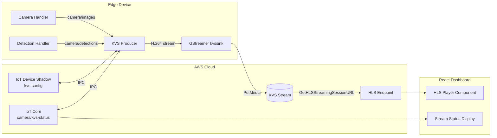

# Design Document: KVS Video Streaming

## Overview

This design adds AWS Kinesis Video Streams (KVS) video transport to the existing Greengrass-based computer vision solution. The feature introduces two primary components:

1. **KVS Producer Greengrass Component** (`com.example.KvsProducer`) — runs on the edge device, subscribes to camera frames and detection results via Greengrass IPC, annotates frames with bounding boxes and labels, encodes them into H.264 video, and streams to a KVS stream in the cloud.

2. **HLS Video Player** — a React component embedded in the existing dashboard that obtains an HLS streaming session URL from KVS using Cognito credentials and plays the live annotated feed.

Supporting changes include AWS resource provisioning (KVS stream, IAM policies), device shadow configuration for runtime tuning, and stream health monitoring via MQTT.

### Design Decisions

| Decision | Rationale |
|----------|-----------|
| Custom KVS Producer component (not `aws.iot.EdgeConnectorForKVS` or `aws.kinesisvideo.KvsEdgeComponent`) | The AWS-provided KVS Greengrass components (`aws.iot.EdgeConnectorForKVS` and `aws.kinesisvideo.KvsEdgeComponent`) only support RTSP IP cameras as video sources. Our use case requires programmatic frame injection — we read frames from disk (Camera Handler output), overlay inference annotations, and push the composited frames into the video pipeline via GStreamer `appsrc`. Neither native component supports custom frame sources or pre-encoding annotation. Additionally, `EdgeConnectorForKVS` requires AWS IoT SiteWise/TwinMaker and is limited to specific regions. |
| Use GStreamer with `kvssink` for H.264 encoding and KVS upload | GStreamer is the recommended pipeline for the KVS Producer SDK on Linux; `kvssink` handles credential refresh, stream creation, and network buffering natively. The KVS Edge Agent itself uses `libgstkvssink` internally. |
| Frame annotation in Python (OpenCV) before passing to GStreamer | Keeps annotation logic testable in pure Python; OpenCV is already a project dependency in the detection handler |
| HLS playback (not WebRTC) in the dashboard | HLS is simpler to integrate, works behind corporate firewalls, and the ~5-10 s latency is acceptable for monitoring |
| Named device shadow (`kvs-config`) for runtime configuration | Follows the existing `model-config` shadow pattern; allows remote tuning without redeployment |
| Health metrics published to IoT Core topic | Consistent with existing detection result publishing; enables CloudWatch rules and dashboard display |

## Architecture



### Data Flow

1. **Camera Handler** captures frames and publishes the image path to `camera/images` (local IPC).
2. **Detection Handler** performs inference and publishes results to `camera/detections` (IoT Core MQTT).
3. **KVS Producer** subscribes to both topics. For each new frame:
   - Reads the image from disk.
   - If a recent detection result is available for that frame, the **Frame Annotator** draws bounding boxes and labels onto the frame.
   - The annotated (or raw) frame is pushed into a GStreamer `appsrc` element.
4. **GStreamer pipeline** encodes frames to H.264 and the `kvssink` element streams to the KVS stream via `PutMedia`.
5. **Dashboard** obtains an HLS session URL using Cognito credentials and plays the stream in an HTML5 video element via `hls.js`.

## Components and Interfaces

### 1. KVS Producer Component (`com.example.KvsProducer`)

**Language:** Python 3  
**Key Dependencies:** `awsiot-greengrasscoreipc`, `opencv-python-headless`, `gi` (PyGObject for GStreamer bindings)

| Module | Responsibility |
|--------|---------------|
| `kvs_producer.py` | Main entry point; orchestrates frame pipeline, shadow config, health reporting |
| `frame_annotator.py` | Draws bounding boxes and labels onto frames using OpenCV |
| `gstreamer_pipeline.py` | Manages GStreamer pipeline lifecycle (appsrc → x264enc → kvssink) |
| `shadow_config.py` | Reads/writes the `kvs-config` named device shadow |
| `health_monitor.py` | Tracks metrics and publishes to `camera/kvs-status` |

**Greengrass Recipe Dependencies:**
- `com.example.CameraHandlerCore` (HARD)
- `com.example.DetectionHandler` (SOFT)
- `aws.greengrass.ShadowManager` (HARD)
- `aws.greengrass.TokenExchangeService` (HARD)

**IPC Access Control:**
- Subscribe to `camera/images` (local pub/sub)
- Subscribe to `camera/detections` (local pub/sub)
- Get/Update shadow `kvs-config`
- Publish to IoT Core `camera/kvs-status`

### 2. Frame Annotator Module

```python
class FrameAnnotator:
    """Draws detection results onto camera frames."""

    def __init__(self, num_classes: int = 10):
        """Initialize with a colour palette for up to num_classes."""

    def annotate(self, frame: np.ndarray, detections: list[Detection]) -> np.ndarray:
        """Draw bounding boxes and labels on frame. Returns annotated copy."""

    def get_colour(self, class_label: str) -> tuple[int, int, int]:
        """Return consistent BGR colour for a given class label."""
```

**Detection data structure** (received from `camera/detections`):
```python
@dataclass
class Detection:
    label: str
    score: float  # 0.0 - 1.0
    xmin: float   # pixel coordinate
    ymin: float
    xmax: float
    ymax: float
```

### 3. GStreamer Pipeline Module

```python
class GStreamerPipeline:
    """Manages the GStreamer encoding and KVS upload pipeline."""

    def __init__(self, stream_name: str, region: str, framerate: int, width: int, height: int):
        """Build pipeline: appsrc ! videoconvert ! x264enc ! kvssink."""

    def push_frame(self, frame: np.ndarray) -> bool:
        """Push a BGR frame into the pipeline. Returns False if pipeline is in error state."""

    def start(self) -> None:
        """Set pipeline to PLAYING state."""

    def stop(self) -> None:
        """Set pipeline to NULL state and release resources."""

    def is_healthy(self) -> bool:
        """Return True if pipeline is in PLAYING or PAUSED state."""

    def reconfigure(self, framerate: int, width: int, height: int) -> None:
        """Restart pipeline with new parameters."""
```

### 4. Shadow Configuration Module

```python
@dataclass
class KvsConfig:
    stream_name: str
    frame_rate: int        # 1-30 fps
    resolution: str        # "640x480" | "1280x720" | "1920x1080"
    streaming_enabled: bool

VALID_RESOLUTIONS = {"640x480", "1280x720", "1920x1080"}
DEFAULT_CONFIG = KvsConfig(
    stream_name="",       # Falls back to recipe configuration
    frame_rate=15,
    resolution="1280x720",
    streaming_enabled=True,
)

class ShadowConfigManager:
    """Manages KVS configuration via the kvs-config device shadow."""

    def read_config(self) -> KvsConfig:
        """Read and validate config from shadow. Returns DEFAULT_CONFIG on failure."""

    def apply_delta(self, delta: dict) -> tuple[KvsConfig, list[str]]:
        """Validate and apply shadow delta. Returns (new_config, rejection_reasons)."""

    def report_state(self, config: KvsConfig, status: str) -> None:
        """Update shadow reported state with active config and streaming status."""
```

### 5. Health Monitor Module

```python
@dataclass
class StreamMetrics:
    frames_sent: int
    frames_dropped: int
    bitrate_kbps: float
    connection_status: str  # "streaming" | "buffering" | "offline" | "error"

class HealthMonitor:
    """Tracks stream health and publishes metrics every 30 seconds."""

    def record_frame_sent(self) -> None
    def record_frame_dropped(self) -> None
    def update_bitrate(self, bytes_sent: int, elapsed_seconds: float) -> None
    def set_status(self, status: str) -> None
    def get_current_metrics(self) -> StreamMetrics
    def publish_metrics(self) -> None  # Publishes to camera/kvs-status
```

### 6. HLS Player React Component

```typescript
interface KvsPlayerProps {
  streamName: string;
  region: string;
}

const KvsPlayer: React.FC<KvsPlayerProps> = ({ streamName, region }) => {
  // Uses useAuth() hook for Cognito credentials
  // Calls KVS GetHLSStreamingSessionURL API
  // Renders <video> element with hls.js
  // Displays connection status overlay
  // Handles credential refresh on expiry
};
```

### 7. Setup Script Extension

The existing `setup_aws_resources.py` is extended with:
- `create_kvs_stream(stream_name, retention_hours=24)` — creates the KVS stream
- `attach_kvs_producer_policy(role_name, stream_arn)` — grants PutMedia, CreateStream, DescribeStream, GetDataEndpoint
- `attach_kvs_viewer_policy(role_name, stream_arn)` — grants GetHLSStreamingSessionURL, GetDataEndpoint, DescribeStream

## Data Models

### KVS Configuration Shadow (`kvs-config`)

```json
{
  "state": {
    "desired": {
      "stream_name": "ubuntu-core-gg-demo-stream",
      "frame_rate": 15,
      "resolution": "1280x720",
      "streaming_enabled": true
    },
    "reported": {
      "stream_name": "ubuntu-core-gg-demo-stream",
      "frame_rate": 15,
      "resolution": "1280x720",
      "streaming_enabled": true,
      "streaming_status": "streaming"
    }
  }
}
```

**Validation Rules:**
- `frame_rate`: integer, 1 ≤ value ≤ 30
- `resolution`: one of `"640x480"`, `"1280x720"`, `"1920x1080"`
- `streaming_enabled`: boolean
- `streaming_status` (reported only): one of `"streaming"`, `"stopped"`, `"error"`

### Stream Health Message (`camera/kvs-status`)

```json
{
  "timestamp": "2024-01-15T10:30:00Z",
  "frames_sent": 450,
  "frames_dropped": 2,
  "bitrate_kbps": 2500.0,
  "connection_status": "streaming",
  "error_reason": null
}
```

### Detection Message (`camera/detections`) — existing format

```json
{
  "model": "faster-rcnn",
  "detections": [
    {
      "label": "person",
      "score": 0.95,
      "box": { "ymin": 100.0, "xmin": 50.0, "ymax": 400.0, "xmax": 200.0 }
    }
  ],
  "count": 1,
  "threshold": 0.5
}
```

### Frame Buffer (Internal)

| Field | Type | Description |
|-------|------|-------------|
| `frames` | `deque[tuple[np.ndarray, float]]` | Ring buffer of (frame, timestamp) pairs |
| `max_duration_seconds` | `float` | 120 seconds max buffer |
| `max_frames` | `int` | Computed from frame_rate × max_duration_seconds |

When the buffer is full and network is unavailable, the oldest frame is dropped (FIFO eviction).

## Correctness Properties

*A property is a characteristic or behavior that should hold true across all valid executions of a system — essentially, a formal statement about what the system should do. Properties serve as the bridge between human-readable specifications and machine-verifiable correctness guarantees.*

### Property 1: Frame buffer capacity and FIFO eviction

*For any* sequence of frames pushed into the frame buffer at any frame rate between 1 and 30 fps, the buffer SHALL never contain more than 120 seconds of video content, AND when the buffer is at capacity and a new frame is inserted, the oldest frame (by timestamp) SHALL be the one evicted.

**Validates: Requirements 1.4, 1.5**

### Property 2: Bounding boxes drawn at specified pixel coordinates

*For any* valid frame (non-empty numpy array with 3 colour channels) and any list of detections with pixel coordinates within the frame dimensions, calling `annotate(frame, detections)` SHALL modify pixels along the bounding box edges defined by (xmin, ymin, xmax, ymax) for each detection, such that the annotated frame differs from the original at those boundary pixels.

**Validates: Requirements 2.1**

### Property 3: Confidence score formatting

*For any* confidence score value between 0.0 and 1.0 (inclusive), the formatted label text SHALL contain the score expressed as a percentage rounded to exactly one decimal place (e.g., 0.956 → "95.6%").

**Validates: Requirements 2.2**

### Property 4: Empty detections preserve frame identity

*For any* valid frame (non-empty numpy array with 3 colour channels), calling `annotate(frame, [])` with an empty detections list SHALL return a frame that is pixel-identical to the input frame.

**Validates: Requirements 2.3**

### Property 5: Colour assignment consistency

*For any* class label string, calling `get_colour(label)` multiple times SHALL always return the same BGR colour tuple, AND the colour palette SHALL contain at least 10 distinct colours.

**Validates: Requirements 2.4**

### Property 6: Stale detection discard

*For any* detection result whose timestamp is less than or equal to the timestamp of the most recently forwarded frame, the Frame Annotator SHALL discard that detection (not apply it to any frame).

**Validates: Requirements 2.6**

### Property 7: Configuration validation

*For any* shadow payload, if `frame_rate` is an integer in [1, 30] AND `resolution` is one of {"640x480", "1280x720", "1920x1080"} AND `streaming_enabled` is a boolean, then `apply_delta` SHALL produce a valid `KvsConfig` matching those values. Conversely, *for any* shadow payload where `frame_rate` is outside [1, 30] OR `resolution` is not in the valid set, `apply_delta` SHALL reject the invalid values, retain the previous valid configuration unchanged, and include a non-empty rejection reason.

**Validates: Requirements 6.1, 6.5**

## Error Handling

### KVS Producer Error Scenarios

| Error Condition | Handling Strategy | Recovery |
|----------------|-------------------|----------|
| Network loss (< 120s) | Buffer frames locally in ring buffer | Auto-resume when connectivity restored; frames sent in order |
| Network loss (> 120s) | Buffer full, evict oldest frames | Continue buffering newest frames; resume when connected |
| Network unreachable > 300s | Unrecoverable error | Publish error to `camera/kvs-status`, attempt 3 restarts at 30s intervals |
| KVS stream deleted | Unrecoverable error | Publish error, attempt restart (which will recreate stream) |
| Invalid credentials | Unrecoverable error | Publish error, attempt restart (Token Exchange Service refreshes credentials) |
| GStreamer pipeline error | Pipeline crash | Log error, restart pipeline with current configuration |
| Shadow unavailable on startup | Degraded start | Use default config, retry shadow read every 30s |
| Invalid shadow config values | Reject invalid values | Retain previous valid config, report rejection in shadow reported state |
| Camera/Detection dependency not running | Startup delay | Wait 30s, then retry every 10s with error logging |
| All 3 restart attempts exhausted | Terminal error state | Publish final error message, remain in error state until manual restart or redeployment |

### Dashboard Error Scenarios

| Error Condition | Handling Strategy | Recovery |
|----------------|-------------------|----------|
| GetHLSStreamingSessionURL fails | Display error message | Retry up to 3 times at 5-second intervals, then show persistent error |
| Stream offline (no data) | Display "Stream Offline" status | Stop playback attempts; resume on manual refresh or stream resumption |
| Cognito credentials expired | Transparent refresh | Refresh credentials via AuthContext, re-establish HLS session without page reload |
| Network error during playback | HLS.js handles buffering | hls.js internal retry; display "buffering" status |

### Setup Script Error Scenarios

| Error Condition | Handling Strategy |
|----------------|-------------------|
| KVS stream creation fails | Log error with AWS API error message, exit with non-zero code |
| IAM policy attachment fails | Log error with AWS API error message, exit with non-zero code |
| KVS stream already exists | Skip creation, log confirmation message |
| IAM policy already attached | Skip attachment, continue without error |

## Testing Strategy

### Unit Tests (Example-Based)

Unit tests cover specific scenarios, edge cases, and integration points:

**KVS Producer (Python — pytest):**
- Recipe validation: verify component dependencies are declared correctly
- Shadow config: test default values when shadow is unavailable
- Shadow config: test streaming enable/disable state transitions
- Health monitor: verify metrics message structure matches schema
- Health monitor: verify error status published after 60s transmission failure
- Restart logic: verify 3 attempts at 30-second intervals, then terminal error state
- Dependency wait: verify 30s initial wait, then 10s retry intervals

**Frame Annotator (Python — pytest):**
- Performance benchmark: annotation completes within 50ms for typical frame sizes
- Annotation with multiple overlapping detections

**Dashboard (TypeScript — vitest):**
- KvsPlayer renders video element
- KvsPlayer displays "offline" status when stream has no data
- KvsPlayer retries GetHLSStreamingSessionURL 3 times on failure
- KvsPlayer refreshes credentials on expiry without page reload
- Dashboard layout shows both HLS player and S3 gallery simultaneously
- Stream status indicator updates from MQTT messages

**Setup Script (Python — pytest):**
- KVS stream creation with correct retention period
- Idempotent behavior when stream already exists
- IAM policy document contains correct actions and resource ARN
- Error handling: non-zero exit on AWS API failure

### Property-Based Tests (Python — Hypothesis)

Property-based tests verify universal correctness properties across generated inputs. Each test runs a minimum of 100 iterations.

| Property | Test Description | Generator Strategy |
|----------|-----------------|-------------------|
| Property 1 | Buffer capacity and FIFO eviction | Random frame sequences with varying timestamps and frame rates (1-30 fps) |
| Property 2 | Bounding boxes at correct coordinates | Random frame dimensions (100-1920 × 100-1080), random detection coordinates within bounds |
| Property 3 | Confidence score formatting | Random floats in [0.0, 1.0] |
| Property 4 | Empty detections preserve frame | Random numpy arrays (various dimensions, 3 channels) |
| Property 5 | Colour assignment consistency | Random Unicode strings as class labels |
| Property 6 | Stale detection discard | Random timestamp sequences for frames and detections |
| Property 7 | Configuration validation | Random integers (including out-of-range), random strings (including valid/invalid resolutions), random booleans |

**Test Configuration:**
- Library: [Hypothesis](https://hypothesis.readthedocs.io/) for Python property tests
- Minimum iterations: 100 per property (`@settings(max_examples=100)`)
- Each test tagged with: `# Feature: kvs-video-streaming, Property {N}: {description}`

### Integration Tests

- End-to-end: KVS Producer encodes frames and streams to a test KVS stream
- Network resilience: simulate network loss, verify buffering and resume
- Shadow integration: update shadow, verify producer applies new config
- Dashboard playback: verify HLS session URL retrieval with valid Cognito credentials

