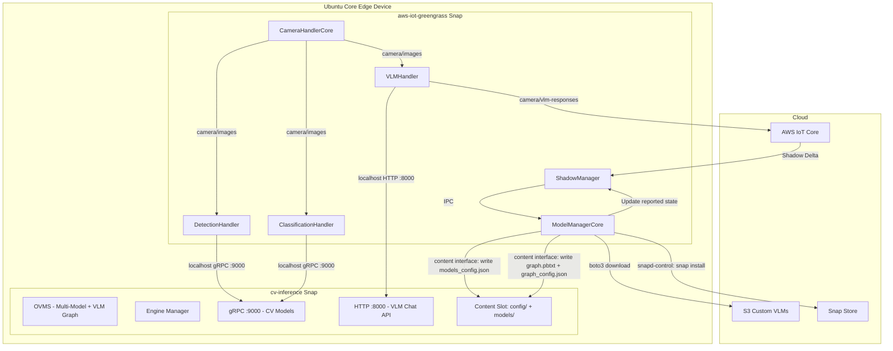
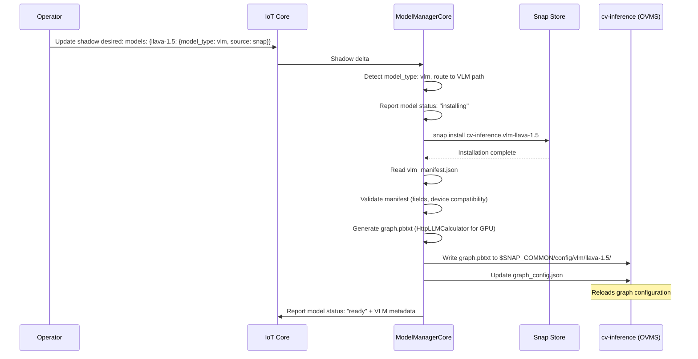
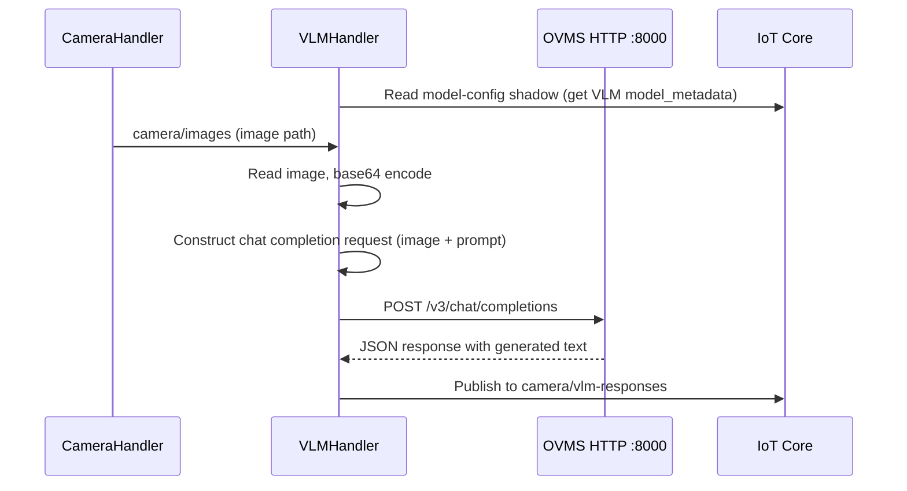
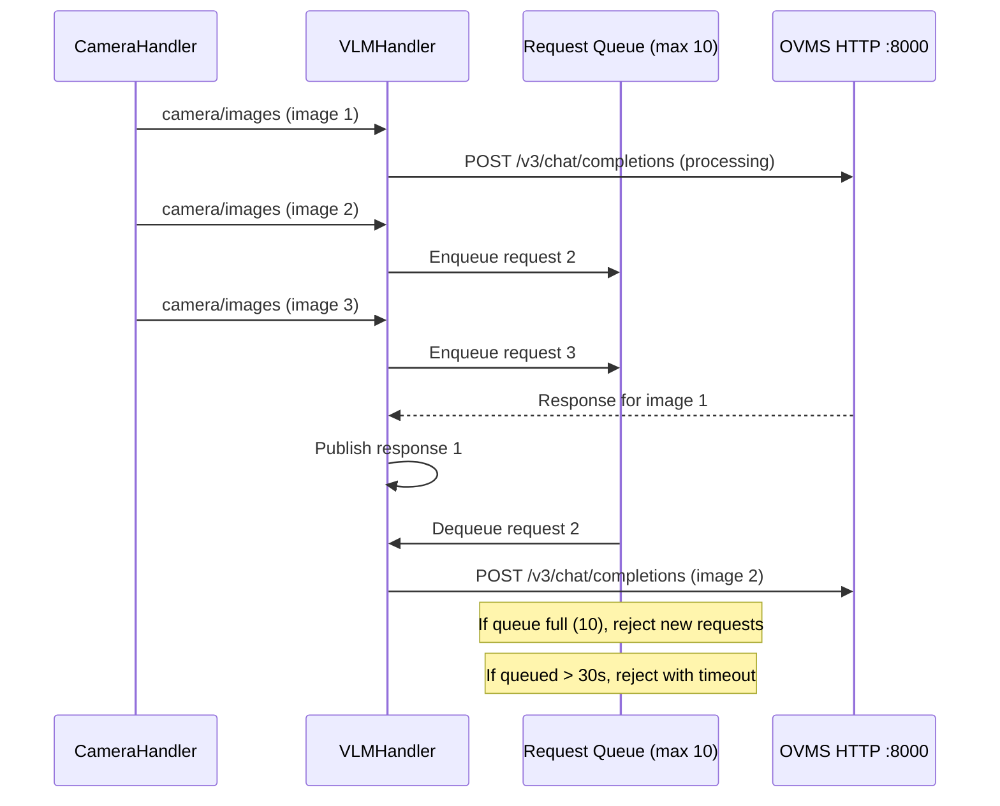
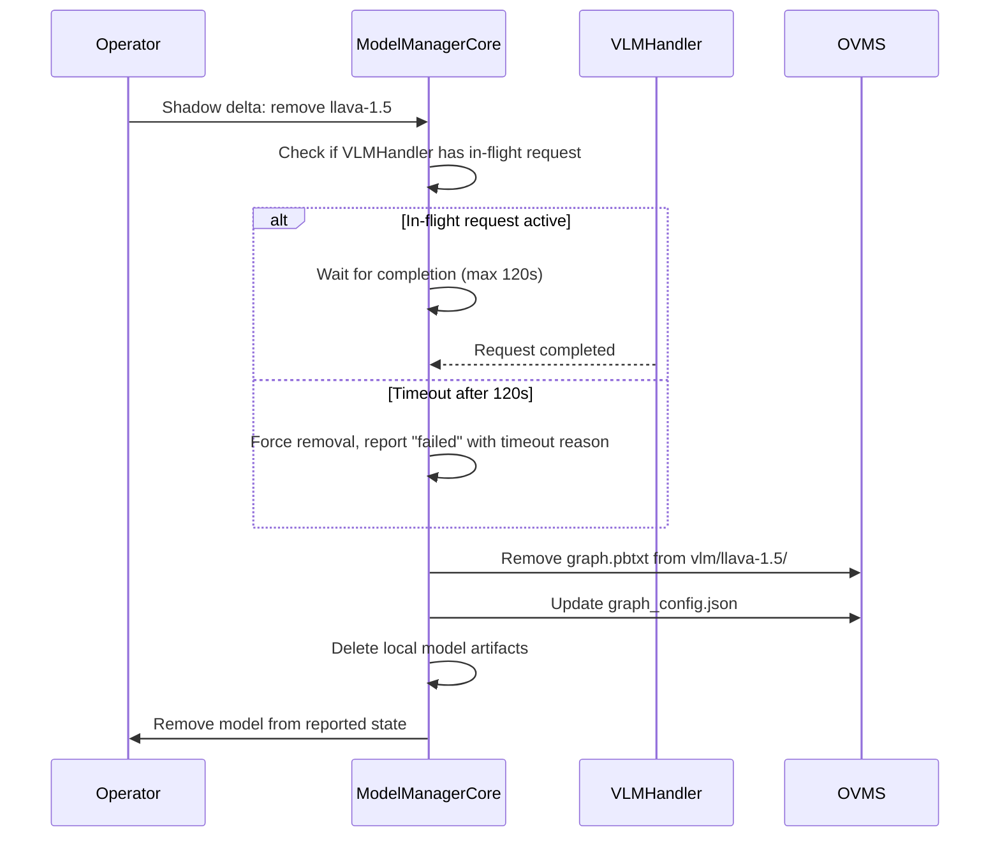

# Design Document: VLM Support

## Overview

VLM Support extends the existing dynamic model management system to serve Vision Language Models (VLMs) alongside traditional computer vision models on the same edge device. VLMs use a fundamentally different serving mechanism in OVMS: MediaPipe graphs with an HttpLLMCalculator node exposing an OpenAI-compatible HTTP `/v3/chat/completions` endpoint, rather than the gRPC tensor predict API used by CV models.

The design adds:
- Shadow schema extension to declare VLM models with `model_type: "vlm"`
- ModelManagerCore logic to install VLMs (snap or S3), validate VLM manifests, and generate `graph.pbtxt` configurations
- A new VLMHandler Greengrass component that sends image+prompt requests via HTTP and publishes text responses
- Inference Snap updates to launch OVMS with both `--config_path` (CV) and `--graph_path` (VLM) parameters, plus HTTP port 8000

Both model types coexist: CV models continue using `models_config.json` + gRPC port 9000, while VLMs use per-model `graph.pbtxt` files + HTTP port 8000. The ModelManagerCore orchestrates both without cross-contamination.

## Ubuntu Core Snap Confinement Model

This design inherits and extends the confinement model from the dynamic-model-management spec. All cross-snap communication uses Canonical's content interface for filesystem sharing and `snapd-control` for snap management.

### Snap Boundaries (Extended for VLM)

| Snap | Role | Key Interfaces |
|------|------|----------------|
| **aws-iot-greengrass** | Orchestration — runs Greengrass components (ModelManagerCore, VLMHandler, handlers) | `snapd-control` (manage snap installs), content plug (write to cv-inference config + models), `network` (HTTP to OVMS) |
| **cv-inference** | Inference runtime — runs OVMS, delivers model components (CV + VLM) | content slot (expose writable config + models dirs), `network-bind` (gRPC :9000 + HTTP :8000) |

### VLM-Specific Cross-Snap Paths

The content interface exposes the same writable directories used by CV models. VLM configuration is written to subdirectories within the shared config space:

| Logical Path | Written By | Purpose |
|---|---|---|
| `config/models_config.json` | ModelManagerCore | CV model serving config (unchanged) |
| `config/vlm/{model_id}/graph.pbtxt` | ModelManagerCore | VLM MediaPipe graph definition |
| `config/graph_config.json` | ModelManagerCore | VLM graph registry for OVMS |
| `models/{model_id}/` | ModelManagerCore | S3-downloaded VLM artifacts |

All paths are accessed via the content interface mount point from the Greengrass snap. OVMS (inside cv-inference) reads them from `$SNAP_COMMON/config/` and `$SNAP_COMMON/models/`.

### VLM Snap Components

VLM models delivered as snap components use the naming convention `cv-inference.vlm-{model_id}`. These are installed via `snapd-control` and their artifacts are accessible to OVMS at:
- `$SNAP/components/vlm-{model_id}/` (read-only, managed by snapd)

ModelManagerCore reads `vlm_manifest.json` from the component path after installation (read access via content interface).

### Network Communication (Extended)

| Protocol | Port | Source | Destination | Purpose |
|----------|------|--------|-------------|---------|
| gRPC | 9000 | DetectionHandler, ClassificationHandler | OVMS | CV model inference |
| HTTP | 8000 | VLMHandler | OVMS | VLM chat completions API |

Both ports are bound by the cv-inference snap (`network-bind`). Handlers in the Greengrass snap connect via `localhost` using the `network` plug.

## Architecture



## Components and Interfaces

### 1. ModelManagerCore (Extended)

The existing ModelManagerCore gains VLM-specific logic:

**New responsibilities:**
- Detect `model_type: "vlm"` in shadow desired state and route to VLM installation path
- Validate `vlm_manifest.json` schema (required fields, type constraints, device compatibility)
- Generate `graph.pbtxt` MediaPipe graph configuration per VLM model
- Write graph service configuration to `$SNAP_COMMON/config/graph_config.json`
- Enforce NPU constraints (Stateful pipeline, single concurrent request)
- Handle VLM removal with in-flight request protection (120s timeout)
- Report VLM-specific error details including `last_error` object

**Interface with OVMS:**
- CV models: writes `$SNAP_COMMON/config/models_config.json` (unchanged)
- VLM models: writes `$SNAP_COMMON/config/vlm/{model_id}/graph.pbtxt` + updates `$SNAP_COMMON/config/graph_config.json`

### 2. VLMHandler (New Component)

A new Greengrass component (`com.example.VLMHandler`) that:
- Reads VLM model_metadata from the `model-config` shadow reported state
- Subscribes to `camera/images` topic
- Constructs OpenAI-compatible chat completion requests with base64-encoded images
- Calls OVMS HTTP endpoint at `http://localhost:8000/v3/chat/completions`
- Publishes responses to `camera/vlm-responses` topic
- Implements NPU-specific request queuing (max 10 queued, 30s queue timeout)
- Handles sequential processing on NPU (one request at a time)

**Configuration:**
- `VLM_PROMPT` environment variable (default: "Describe this image")
- `VLM_MODEL_ID` component configuration (which VLM from shadow to use)

### 3. cv-inference Snap (Extended)

**New startup parameters:**
- `--rest_port 8000` for HTTP chat completions API
- `--graph_path $SNAP_COMMON/config/vlm_graphs/` when VLM components are installed

**Engine server script changes:**
- CPU/GPU: add `--rest_port` and `--graph_path` parameters
- NPU: add `--rest_port`, `--graph_path`, and `--max_concurrent_requests 1`

**New snap components:**
- VLM models use naming convention `cv-inference.vlm-{model_id}`
- Each VLM component includes model weights, tokenizers, chat template, and `vlm_manifest.json`

**Content interface slots (extended):**
```yaml
slots:
  inference-config:
    interface: content
    content: inference-config
    write:
      - $SNAP_COMMON/config
  inference-models:
    interface: content
    content: inference-models
    write:
      - $SNAP_COMMON/models
```

The `inference-config` slot now serves both CV config (`models_config.json`) and VLM config (`vlm/{model_id}/graph.pbtxt`, `graph_config.json`). No additional slots are needed for VLM support — the existing content interface is model-type agnostic.

**Network binding (extended):**
```yaml
apps:
  ovms:
    plugs:
      - network
      - network-bind  # binds both gRPC :9000 and HTTP :8000
```

### 4. Existing Components (Unchanged)

- **DetectionHandler**: continues using gRPC port 9000, unaffected by VLM additions
- **ClassificationHandler**: continues using gRPC port 9000, unaffected by VLM additions
- **CameraHandlerCore**: publishes to `camera/images`, consumed by all handlers including VLMHandler

## Data Models

### Extended Shadow Schema

#### Desired State (with VLM)

```json
{
  "state": {
    "desired": {
      "models": {
        "faster-rcnn": { "source": "snap" },
        "llava-1.5": {
          "model_type": "vlm",
          "source": "snap",
          "model_name": "llava-1.5-7b"
        },
        "custom-vlm": {
          "model_type": "vlm",
          "source": "s3",
          "model_name": "my-custom-vlm",
          "s3_uri": "s3://my-bucket/vlm-models/custom-vlm/1.0/"
        }
      }
    }
  }
}
```

#### Reported State (with VLM)

```json
{
  "state": {
    "reported": {
      "engine": "gpu",
      "status": "ready",
      "models": {
        "faster-rcnn": {
          "status": "ready",
          "model_metadata": {
            "model_name": "faster_rcnn",
            "input_name": "input_tensor",
            "output_names": ["detection_boxes", "detection_classes", "detection_scores"],
            "input_shape": [1, 255, 255, 3],
            "labels_file": "labels.txt",
            "local_path": "/snap/cv-inference/components/model-faster-rcnn/"
          }
        },
        "llava-1.5": {
          "status": "ready",
          "model_metadata": {
            "model_name": "llava-1.5-7b",
            "model_type": "vlm",
            "endpoint_port": 8000,
            "device": "gpu",
            "cache_size": 1024,
            "max_num_batched_tokens": 2048,
            "supported_features": ["image_understanding", "streaming"],
            "pipeline": "continuous_batching",
            "local_path": "/snap/cv-inference/components/vlm-llava-1.5/"
          }
        }
      }
    }
  }
}
```

#### NPU Reported State (VLM with constraints)

```json
{
  "llava-1.5": {
    "status": "ready",
    "model_metadata": {
      "model_name": "llava-1.5-7b",
      "model_type": "vlm",
      "endpoint_port": 8000,
      "device": "npu",
      "cache_size": 512,
      "max_num_batched_tokens": 1024,
      "supported_features": ["image_understanding"],
      "pipeline": "stateful",
      "max_concurrent_requests": 1,
      "local_path": "/snap/cv-inference/components/vlm-llava-1.5/"
    }
  }
}
```

### VLM Manifest Schema (`vlm_manifest.json`)

```json
{
  "model_id": "llava-1.5",
  "model_name": "llava-1.5-7b",
  "model_type": "vlm",
  "version": "1.0.0",
  "models_path": "./model",
  "cache_size": 1024,
  "max_num_batched_tokens": 2048,
  "device_targets": ["CPU", "GPU"],
  "chat_template_file": "chat_template.jinja",
  "tokenizer_config_file": "tokenizer_config.json",
  "max_num_seqs": 256,
  "best_of_limit": 1,
  "default_prompt": "Describe this image in detail"
}
```

**Required fields:**
| Field | Type | Constraints |
|-------|------|-------------|
| `model_id` | string | 1-64 chars, alphanumeric + hyphens |
| `model_name` | string | 1-128 chars |
| `model_type` | string | Must be "vlm" |
| `version` | string | Semver format (MAJOR.MINOR.PATCH) |
| `models_path` | string | Relative path to model artifacts |
| `cache_size` | integer | Minimum 1 |
| `max_num_batched_tokens` | integer | Minimum 1 |
| `device_targets` | array[string] | Non-empty, values from: "CPU", "GPU", "NPU" |
| `chat_template_file` | string | Filename of Jinja2 template |
| `tokenizer_config_file` | string | Filename of tokenizer config |

**Optional fields:**
| Field | Type | Default | Constraints |
|-------|------|---------|-------------|
| `max_num_seqs` | integer | 256 | Minimum 1 |
| `best_of_limit` | integer | 1 | Minimum 1 |
| `default_prompt` | string | - | Maximum 1024 chars |

### Graph Configuration (`graph.pbtxt`)

Generated per VLM model by ModelManagerCore:

```protobuf
input_stream: "HTTP_REQUEST_PAYLOAD:input"
output_stream: "HTTP_RESPONSE_PAYLOAD:output"

node {
  calculator: "HttpLLMCalculator"
  input_stream: "HTTP_REQUEST_PAYLOAD:input"
  output_stream: "HTTP_RESPONSE_PAYLOAD:output"
  node_options: {
    [type.googleapis.com/mediapipe.LLMCalculatorOptions]: {
      models_path: "/snap/cv-inference/components/vlm-llava-1.5/model"
      cache_size: 1024
      max_num_batched_tokens: 2048
      device: "GPU"
      max_num_seqs: 256
      dynamic_split_fuse: true
    }
  }
}
```

For NPU, the calculator changes to `StatefulLLMCalculator` and `dynamic_split_fuse` is omitted:

```protobuf
node {
  calculator: "StatefulLLMCalculator"
  input_stream: "HTTP_REQUEST_PAYLOAD:input"
  output_stream: "HTTP_RESPONSE_PAYLOAD:output"
  node_options: {
    [type.googleapis.com/mediapipe.LLMCalculatorOptions]: {
      models_path: "/snap/cv-inference/components/vlm-llava-1.5/model"
      cache_size: 512
      max_num_batched_tokens: 1024
      device: "NPU"
      max_num_seqs: 1
    }
  }
}
```

### Graph Service Configuration (`graph_config.json`)

Written by ModelManagerCore to register VLM graphs with OVMS:

```json
{
  "mediapipe_config_list": [
    {
      "name": "llava-1.5",
      "base_path": "/var/snap/cv-inference/common/config/vlm/llava-1.5"
    }
  ]
}
```

### VLM Chat Completions Request Format

```json
{
  "model": "llava-1.5-7b",
  "messages": [
    {
      "role": "user",
      "content": [
        {
          "type": "text",
          "text": "Describe this image"
        },
        {
          "type": "image_url",
          "image_url": {
            "url": "data:image/jpeg;base64,/9j/4AAQ..."
          }
        }
      ]
    }
  ],
  "stream": false
}
```

### VLM Response Published to `camera/vlm-responses`

```json
{
  "model_name": "llava-1.5-7b",
  "prompt": "Describe this image",
  "response_text": "The image shows a person wearing a hard hat...",
  "source_image_path": "/tmp/camera/frame_001.jpg",
  "timestamp": "2024-01-15T10:30:00Z"
}
```

### Error Reporting Schema (VLM-specific)

```json
{
  "llava-1.5": {
    "status": "failed",
    "reason": "Model does not support active device: NPU not in device_targets [CPU, GPU]",
    "last_error": {
      "timestamp": "2024-01-15T10:30:00Z",
      "error_type": "validation",
      "message": "Model does not support active device: NPU not in device_targets [CPU, GPU]"
    }
  }
}
```

## Flow: VLM Installation and Configuration



## Flow: VLM Inference



## Flow: NPU Request Queuing



## Flow: VLM Removal with In-Flight Protection



## Correctness Properties

*A property is a characteristic or behavior that should hold true across all valid executions of a system — essentially, a formal statement about what the system should do. Properties serve as the bridge between human-readable specifications and machine-verifiable correctness guarantees.*

### Property 1: CV/VLM Configuration Isolation

*For any* combination of CV models and VLM models in the desired state, adding, removing, or modifying a VLM model SHALL NOT alter the contents of `models_config.json`, and adding, removing, or modifying a CV model SHALL NOT alter any `graph.pbtxt` file or `graph_config.json`.

**Validates: Requirements 1.2, 1.4, 4.6**

### Property 2: VLM Manifest Validation Completeness

*For any* JSON object presented as a `vlm_manifest.json`, the manifest validator SHALL accept it if and only if all required fields are present with correct types and constraints (model_id: 1-64 chars alphanumeric+hyphens, model_name: 1-128 chars, model_type: "vlm", version: semver, models_path: non-empty string, cache_size: integer >= 1, max_num_batched_tokens: integer >= 1, device_targets: non-empty array of "CPU"/"GPU"/"NPU", chat_template_file: non-empty string, tokenizer_config_file: non-empty string), and SHALL reject with a reason listing each validation error otherwise.

**Validates: Requirements 7.1, 7.3, 7.4, 1.5**

### Property 3: VLM Manifest Optional Field Defaults

*For any* valid VLM manifest that omits optional fields, the system SHALL apply defaults: `max_num_seqs` = 256, `best_of_limit` = 1, and these defaults SHALL appear in the generated graph configuration.

**Validates: Requirements 7.2**

### Property 4: Device Compatibility Enforcement

*For any* VLM manifest and any active hardware engine, if the active engine (uppercase) is not present in the manifest's `device_targets` array, the system SHALL report the model status as `failed` with a reason indicating the device incompatibility.

**Validates: Requirements 7.5**

### Property 5: Graph Generation Correctness

*For any* valid VLM manifest and any active engine (CPU, GPU, or NPU), the generated `graph.pbtxt` SHALL use `HttpLLMCalculator` when the engine is CPU or GPU, and `StatefulLLMCalculator` when the engine is NPU; and SHALL correctly map `models_path`, `cache_size`, `max_num_batched_tokens`, and `device` from the manifest and engine into the graph node_options.

**Validates: Requirements 4.1, 4.2, 4.3, 10.1**

### Property 6: Graph Registry Completeness

*For any* set of VLM models with status `ready`, the `graph_config.json` SHALL contain exactly one entry per ready VLM model with the correct `name` and `base_path`, and SHALL NOT contain entries for models that are not ready or have been removed.

**Validates: Requirements 4.5**

### Property 7: VLM Reported State Completeness

*For any* VLM model that reaches status `ready`, the reported state SHALL include all required metadata fields: `model_name`, `model_type` ("vlm"), `endpoint_port` (integer 9001-65535), `device` (one of cpu/gpu/npu), `cache_size`, `max_num_batched_tokens`, `supported_features` (list), and `local_path`; and when the engine is NPU, SHALL additionally include `pipeline: "stateful"` and `max_concurrent_requests: 1`.

**Validates: Requirements 1.3, 10.5**

### Property 8: Missing Artifact Reporting

*For any* subset of required VLM artifacts (openvino_model.bin, openvino_model.xml, openvino_tokenizer.bin, openvino_tokenizer.xml, openvino_detokenizer.bin, openvino_detokenizer.xml, tokenizer_config.json, chat_template.jinja) that is absent from the model directory, the failure reason SHALL list each missing artifact by filename.

**Validates: Requirements 3.4**

### Property 9: Chat Request Construction

*For any* image byte sequence and any prompt string, the VLMHandler SHALL construct a chat completion request where the image is correctly base64-encoded with the `data:image/*;base64,` prefix in the message content, and the prompt text appears as a text content entry in the same message.

**Validates: Requirements 6.2**

### Property 10: VLM Response Publishing Completeness

*For any* successful OVMS response, the message published to `camera/vlm-responses` SHALL contain the model response text, the source image path as received from the `camera/images` message, and the prompt used.

**Validates: Requirements 6.4**

### Property 11: NPU Queue Management

*For any* sequence of incoming requests when the active engine is NPU: at most 1 request SHALL be actively processing at any time, at most 10 requests SHALL be queued, requests queued longer than 30 seconds SHALL be rejected with a queue timeout error, and new requests arriving when the queue contains 10 items SHALL be rejected with a capacity error.

**Validates: Requirements 10.2, 10.3, 10.4**

### Property 12: NPU Single-Image Enforcement

*For any* chat completion request containing more than one image when the active engine is NPU, the VLMHandler SHALL reject the request with an error indicating the NPU single-image limitation.

**Validates: Requirements 10.6**

### Property 13: Error Object Persistence

*For any* VLM model error event, the reported state SHALL include a `last_error` object with `timestamp` (ISO 8601 UTC), `error_type` (one of `graph_generation`, `graph_load`, `validation`), and `message` (max 512 chars); and when the model subsequently transitions from `failed` to `ready`, the `last_error` field SHALL be retained from the previous failure.

**Validates: Requirements 11.4, 11.5**

### Property 14: In-Flight Removal Protection

*For any* VLM model with an actively processing request, removal SHALL NOT proceed until the request completes or 120 seconds elapse, whichever comes first.

**Validates: Requirements 9.3**

## Error Handling

### ModelManagerCore Error Scenarios

| Error Condition | Behavior | Reported State |
|----------------|----------|----------------|
| VLM desired entry missing required fields | Reject immediately | `status: "failed"`, reason lists missing fields |
| Snap install fails | Report failure | `status: "failed"`, reason from snap stderr |
| S3 download fails (network/access/invalid URI) | Report failure | `status: "failed"`, reason describes cause |
| vlm_manifest.json not found | Report failure | `status: "failed"`, reason: manifest not found |
| vlm_manifest.json invalid JSON | Report failure | `status: "failed"`, reason: parse error |
| Manifest validation fails | Report failure | `status: "failed"`, reason lists each error |
| Device not in device_targets | Report failure | `status: "failed"`, reason: device incompatible |
| Required artifacts missing | Report failure | `status: "failed"`, reason lists missing files |
| graph.pbtxt write fails (filesystem) | Report failure | `status: "failed"`, reason: write error |
| OVMS fails to load graph | Report failure | `status: "failed"`, reason: OVMS load error |
| Removal timeout (120s) | Force remove | `status: "failed"` briefly, then key removed |

### VLMHandler Error Scenarios

| Error Condition | Behavior |
|----------------|----------|
| VLM model not ready | Retry every 10 seconds |
| HTTP 4xx/5xx from OVMS | Log error, continue processing next image |
| Connection timeout (30s) | Log error, continue processing next image |
| NPU: multiple images in request | Reject with single-image error |
| NPU: queue full (10 items) | Reject with capacity error |
| NPU: queue timeout (30s) | Reject queued request with timeout error |

### Error Object Structure

Every VLM error updates the `last_error` field in reported state:

```json
{
  "last_error": {
    "timestamp": "2024-01-15T10:30:00Z",
    "error_type": "graph_generation",
    "message": "Failed to write graph.pbtxt: Permission denied on /var/snap/cv-inference/common/config/vlm/llava-1.5/"
  }
}
```

The `last_error` persists even after recovery to `ready` status, providing operators with historical error context.

## Testing Strategy

### Unit Tests

Unit tests cover specific examples, edge cases, and integration points:

- **ModelManagerCore VLM routing**: verify model_type detection routes to correct installation path
- **Snap install naming**: verify `cv-inference.vlm-{model_id}` convention
- **S3 download path**: verify download to `$SNAP_COMMON/models/{model_id}/`
- **Graph file path**: verify write to `$SNAP_COMMON/config/vlm/{model_id}/graph.pbtxt`
- **VLMHandler retry**: verify 10-second retry interval when model not ready
- **VLMHandler error resilience**: verify handler continues after HTTP errors
- **Removal cleanup**: verify all three locations cleaned (graph file, graph_config entry, artifacts)
- **NPU startup config**: verify `--max_concurrent_requests 1` in NPU engine script

### Property-Based Tests

Property-based tests verify universal properties across generated inputs. Use `hypothesis` (Python) with minimum 100 iterations per property.

Each property test references its design document property:

- **Feature: vlm-support, Property 1**: CV/VLM configuration isolation
- **Feature: vlm-support, Property 2**: VLM manifest validation completeness
- **Feature: vlm-support, Property 3**: Optional field defaults
- **Feature: vlm-support, Property 4**: Device compatibility enforcement
- **Feature: vlm-support, Property 5**: Graph generation correctness
- **Feature: vlm-support, Property 6**: Graph registry completeness
- **Feature: vlm-support, Property 7**: VLM reported state completeness
- **Feature: vlm-support, Property 8**: Missing artifact reporting
- **Feature: vlm-support, Property 9**: Chat request construction
- **Feature: vlm-support, Property 10**: VLM response publishing completeness
- **Feature: vlm-support, Property 11**: NPU queue management
- **Feature: vlm-support, Property 12**: NPU single-image enforcement
- **Feature: vlm-support, Property 13**: Error object persistence
- **Feature: vlm-support, Property 14**: In-flight removal protection

**Test configuration:**
- Library: `hypothesis` (Python property-based testing)
- Minimum iterations: 100 per property (`@settings(max_examples=100)`)
- Custom strategies for VLM manifests, model configs, image payloads, and queue states

### Integration Tests

Integration tests verify end-to-end flows with mocked external services:

- Shadow delta with VLM model → install → graph generation → reported state ready
- Mixed CV + VLM shadow → both types configured independently
- VLM removal → graph cleanup → reported state updated
- VLMHandler → HTTP request to mock OVMS → response published
- NPU mode: sequential processing with queue behavior

### What Is NOT Tested via PBT

- OVMS HTTP endpoint behavior (external service — integration tests only)
- Snap installation mechanics (subprocess — mock in unit tests)
- S3 download behavior (boto3 — mock in unit tests)
- Snap component packaging (smoke tests during build)
- OVMS graph reload timing (integration test with real OVMS)

