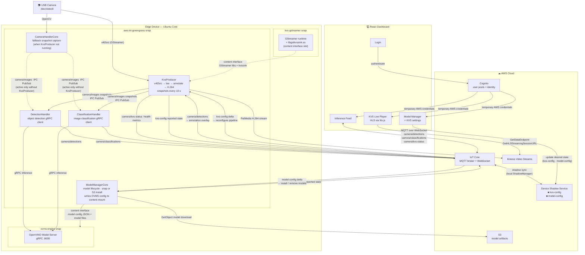

# System Architecture

End-to-end integration between Ubuntu Core snaps, AWS Greengrass components, AWS cloud services, and the React dashboard.

---

## Key Message Topics

| Topic | Direction | Publisher | Subscriber(s) |
|-------|-----------|-----------|----------------|
| `camera/images` | IPC PubSub (local) | CameraHandlerCore *or* KvsProducer | DetectionHandler, ClassificationHandler |
| `camera/detections` | MQTT (IoT Core) | DetectionHandler | KvsProducer, React Dashboard |
| `camera/classifications` | MQTT (IoT Core) | ClassificationHandler | React Dashboard |
| `camera/kvs-status` | MQTT (IoT Core) | KvsProducer | React Dashboard |
| `$aws/.../kvs-config/update/delta` | MQTT (IoT Core shadow) | Device Shadow Service | KvsProducer |
| `$aws/.../model-config/update/delta` | MQTT (IoT Core shadow) | Device Shadow Service | ModelManagerCore |

## Snap Boundaries & Interfaces

| Interface | Provider snap | Consumer | What crosses |
|-----------|--------------|----------|--------------|
| `gstreamer-kvs` content slot | kvs-gstreamer | KvsProducer (aws-iot-greengrass) | GStreamer runtime libs + `libgstkvssink.so` |
| `inference-config` content slot | ovms-engine | ModelManagerCore (aws-iot-greengrass) | OVMS `models_config.json` write path |
| `inference-models` content slot | ovms-engine | ModelManagerCore (aws-iot-greengrass) | Model files directory write path |
| `camera` plug | aws-iot-greengrass | — | Access to `/dev/video*` |
